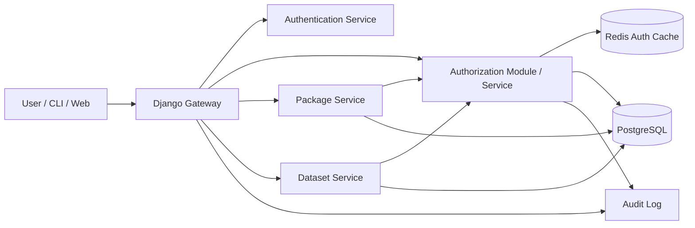
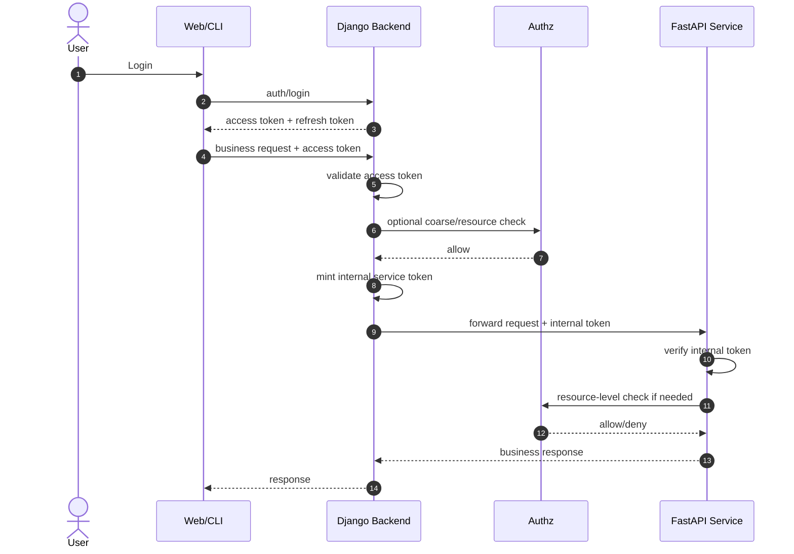
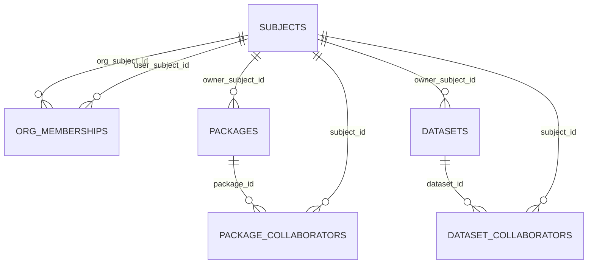
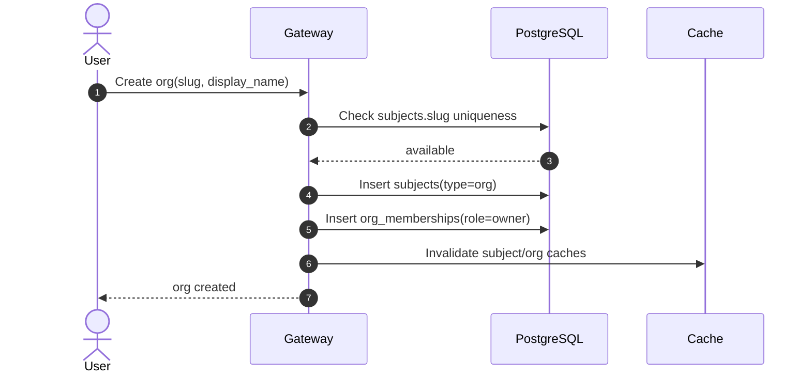
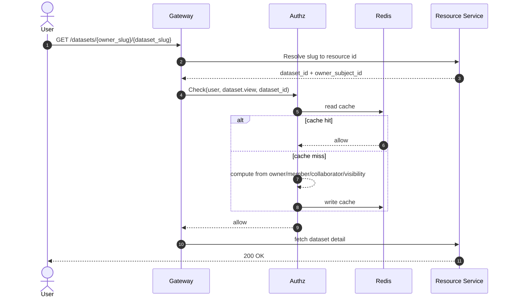
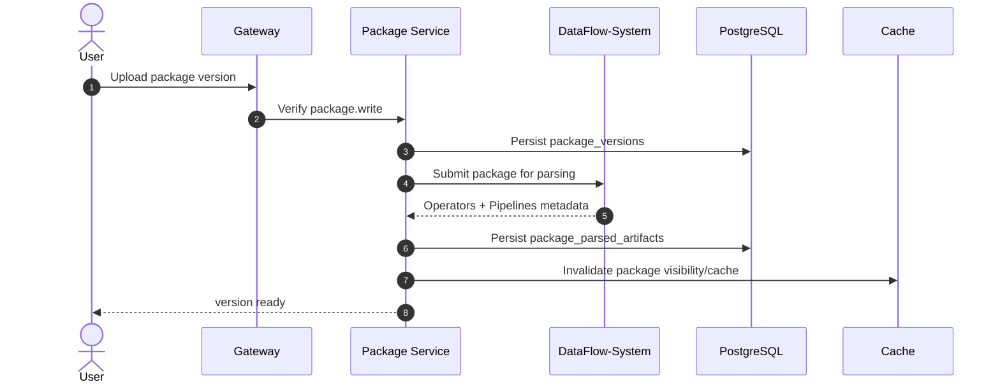
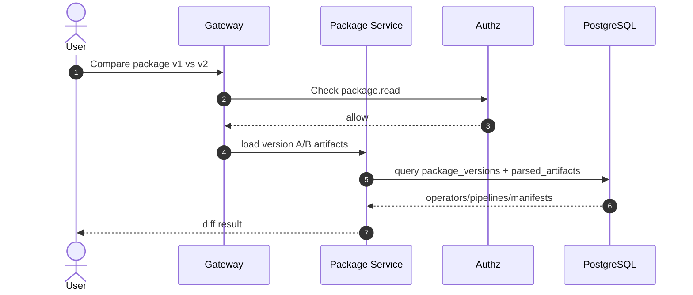
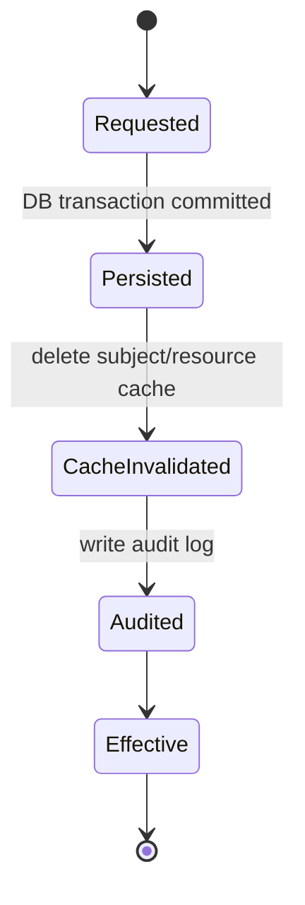

# 用户、组织与权限系统技术方案

> 适用范围：DCAI 平台的 User / Organization / Authentication / Authorization 体系设计  
> 目标：在 AI Coding 快速迭代模式下，为 Packages、Datasets 及后续 Models / Apps 提供统一、可扩展、可审计的权限基础设施  
> 参考基线：[docs/dcai_authorization_design-zh.md](/home/linpengt/workspace/dcai-platform/docs/dcai_authorization_design-zh.md)

---

## 1. 文档目标与设计原则

本方案将现有授权设计与新需求合并，沉淀为可直接进入开发评审的结构化文档，并按照分层技术评审体系组织：

1. 架构层：系统架构、安全设计、性能指标
2. 接口层：OpenAPI 规范、错误码定义
3. 数据层：数据模型 DDL、索引策略
4. 业务层：核心业务流程、状态机设计
5. 质量层：代码规范、测试策略

设计原则：

- User 与 Organization 共享全局命名空间
- 统一主体模型，内部以 `subject` 抽象身份
- 统一资源所有权模型，资源只认 `owner_subject_id`
- 统一权限语义，业务服务不散落实现权限规则
- 个人资源支持协作者，组织资源通过组织成员角色继承权限
- URL 使用 slug，授权与存储内部使用稳定 ID
- 细粒度资源权限不写入长期 token
- 列表权限结果允许使用 Redis 缓存，但权限变更必须强制失效
- 资源权限整体对齐 HuggingFace 风格，统一采用 `owner/admin/write/read`，并允许 Package 增加 `proprietary` 作为平台扩展可见性

---

## 2. 总体结论

建议采用三层身份与权限体系：

1. Authentication
   负责用户登录、Token 签发、内部 Token Exchange、Session 管理
2. Authorization
   负责统一判断 `subject` 是否可对 `resource` 执行 `action`
3. Resource Services
   负责 Packages、Datasets 等资源元数据与业务逻辑，不自行发明权限模型

核心结论：

- 用户、组织、未来的 service account 都进入统一 `subjects` 表
- Packages、Datasets 共享统一 owner、角色与可见性模型
- 组织资源权限继承自 `org_memberships`
- 个人资源才允许 `*_collaborators`
- Django Gateway 作为入口层做认证、粗鉴权和 token exchange
- 下游 Resource Service 做资源级鉴权
- 鉴权结果支持 Redis 缓存，变更时按 subject 和 resource 维度精确失效

---

## 3. 架构层评审

### 3.1 系统架构



职责划分：

- Django Gateway
  - 校验用户 Access Token
  - 解析 active org 上下文
  - 处理 slug 到内部 ID 的入口解析
  - 在必要时签发内部短时 Token
- Authentication Service
  - 登录、刷新、注销、内部 Token Exchange
  - 提供稳定 `sub`
- Authorization Module / Service
  - 提供 `Check`、`CheckBulk`、`Expand`、`WriteTuples`
  - 对 Packages / Datasets 使用统一规则
- Package / Dataset Service
  - 管理资源元数据
  - 对详情、修改、删除、列表执行资源级鉴权
- Redis Auth Cache
  - 缓存用户可见资源集合与 `CheckBulk` 结果
- PostgreSQL
  - 身份、成员关系、资源元数据、协作者与审计真相源

### 3.2 统一身份与所有权模型

统一主体：

- `subject.type = user | org`
- 后续可扩展 `service_account | api_key`

统一所有权：

- `packages.owner_subject_id`
- `datasets.owner_subject_id`

统一 URL：

- Package: `/{owner_slug}/{package_slug}`
- Dataset: `/datasets/{owner_slug}/{dataset_slug}`

统一动作语义：

- `package.read | write | admin | delete | transfer`
- `dataset.view | edit | admin | delete | transfer`

### 3.3 可见性定义

通用可见性定义如下：

- `private`
  - 仅资源 owner、组织继承成员、显式授权协作者可访问
  - 其他人既不可读，也不可用
- `public`
  - 匿名用户或外部访问者可读
  - 修改、管理、删除仍需 owner 或继承权限

Package 平台扩展可见性：

- `proprietary`
  - 对外允许使用 Package 能力，但不开放源码、版本明细和完整配置读取
  - 适用于商业化算法包、闭源处理包、受限共享资产
  - 这是在 HuggingFace 风格基础上的平台定制扩展，不影响统一 owner / role 模型

因此建议：

- Dataset 使用 `private | public`
- Package 使用 `private | public | proprietary`

对齐 HuggingFace 风格后的简化结论：

- Dataset 可见性为 `private/public`
- Package 可见性为 `private/public/proprietary`
- 权限角色只有 `owner/admin/write/read`
- Package 的“可用”默认由 `read` 权限派生，但 `proprietary` 允许“可用不可读”

### 3.4 安全设计

认证与授权边界：

- Access Token 仅承载身份上下文与粗粒度 scope
- 资源级权限必须通过统一授权层计算
- 内部服务只信任内部签发链，不直接信任外部 Access Token
- 高风险操作可以强制实时回源，不信任缓存

安全约束：

- `sub` 必须使用稳定 ID，不使用 slug
- slug 仅用于 URL 与展示，允许改名
- 组织切换必须显式携带 `active_org_id`
- 资源转移 owner 时必须触发缓存失效与审计记录
- 协作者仅允许挂载在个人资源，组织资源禁止直配 collaborator

### 3.4.1 Token 签发与验证逻辑

推荐采用统一签发、分层验证模式：

- Django Backend 作为统一认证入口和 Token 签发方
- FastAPI 微服务只接受 Django 签发的内部 Token
- FastAPI 负责验证 Token 合法性，但不把 Token 验证等同于资源级授权

推荐拆分两类 Token：

1. Access Token
   - 面向 Web / CLI
   - 由 Django 签发
   - 用于用户登录态和访问 Gateway
2. Internal Service Token
   - 面向 FastAPI 微服务
   - 由 Django 通过 token exchange 签发
   - 用于服务间调用

典型链路：



职责边界：

- Django
  - 负责登录、刷新、注销
  - 负责签发 Access Token 与 Internal Service Token
  - 负责 token exchange
  - 负责把外部用户上下文收敛为内部可信调用上下文
- FastAPI
  - 只验证内部 Token，不直接信任前端 Access Token
  - 验证通过后再按需要调用统一授权接口
  - 不自行扩散一套独立登录与签发体系

#### Access Token 建议 Claim

```json
{
  "iss": "dcai-django-auth",
  "sub": "usr_123",
  "subject_type": "user",
  "slug": "alice",
  "active_org_id": "org_456",
  "scope": ["packages:read", "datasets:read"],
  "aud": "dcai-gateway",
  "iat": 1760000000,
  "exp": 1760003600,
  "jti": "atk_001"
}
```

字段约束：

- `sub` 必须是稳定用户 ID
- `slug` 可选，仅用于展示和辅助上下文
- `scope` 只表达粗粒度能力，不表达具体资源 ACL
- `aud` 必须绑定 Gateway，避免前端 Token 被下游服务误用

#### Internal Service Token 建议 Claim

```json
{
  "iss": "dcai-django-auth",
  "sub": "usr_123",
  "subject_type": "user",
  "active_org_id": "org_456",
  "scope": ["package:read", "package:write"],
  "aud": "package-service",
  "azp": "django-gateway",
  "act": {
    "sub": "django-gateway"
  },
  "iat": 1760000000,
  "exp": 1760000300,
  "jti": "itk_001"
}
```

字段约束：

- `aud` 必须绑定单个目标微服务
- `azp` / `act` 用于表达调用链和代理方
- TTL 应明显短于 Access Token，建议 1 到 5 分钟
- 仍然不承载资源级 ACL，只承载可信身份上下文

#### Django 签发逻辑

登录签发：

1. 用户通过账号体系登录 Django
2. Django 校验凭证与用户状态
3. Django 生成 Access Token 和 Refresh Token
4. Access Token 返回给 Web/CLI

内部换票签发：

1. Django 收到前端业务请求
2. Django 验证 Access Token
3. Django 解析当前用户、active org、粗 scope
4. Django 视情况执行一次入口鉴权
5. Django 为目标 FastAPI 服务签发短时 Internal Service Token
6. Django 携带 Internal Service Token 转发请求

#### FastAPI 验证逻辑

FastAPI 标准验证步骤：

1. 从 `Authorization: Bearer <token>` 读取 Token
2. 校验签名、过期时间、发行方 `iss`
3. 校验 `aud` 是否匹配当前服务
4. 校验 `azp` / `act` 是否来自受信任 Gateway
5. 解析 `sub`、`subject_type`、`active_org_id`、`scope`
6. 如涉及资源读写，再调用 `Check` 或 `CheckBulk`

必须拒绝的情况：

- Token 签名非法
- Token 已过期
- `aud` 不匹配当前 FastAPI 服务
- `iss` 不是平台认证服务
- 调用方不是受信任的 Django Gateway

#### Django / FastAPI 实现约束

- Token 签发私钥只保存在 Django 认证侧
- FastAPI 只持有公钥或 JWKS 拉取能力
- 推荐使用非对称签名算法，如 `RS256` 或 `EdDSA`
- FastAPI 不应共享 refresh token 逻辑
- 微服务不应自行签发面向前端的登录 Token

#### 资源级授权边界

必须强调：

- Token 验证成功，只说明“这个调用身份可信”
- 不代表该主体一定能访问某个具体 Package 或 Dataset
- 资源级操作仍需调用统一授权接口

例外情况：

- 如果 Django 已签发极短时、资源绑定的 capability token
- 且 Token 中明确绑定 `resource_id + actions + aud`
- FastAPI 可以在短窗口内跳过重复 `Check`
- 高风险操作仍建议强制回源鉴权

#### FastAPI 验证伪代码

```python
from fastapi import Header, HTTPException
import jwt


def validate_internal_token(authorization: str) -> dict:
    if not authorization.startswith("Bearer "):
        raise HTTPException(status_code=401, detail="missing bearer token")

    token = authorization.removeprefix("Bearer ").strip()

    try:
        payload = jwt.decode(
            token,
            PUBLIC_KEY,
            algorithms=["RS256"],
            issuer="dcai-django-auth",
            audience="package-service",
        )
    except jwt.PyJWTError as exc:
        raise HTTPException(status_code=401, detail="invalid token") from exc

    if payload.get("azp") != "django-gateway":
        raise HTTPException(status_code=403, detail="untrusted caller")

    return payload
```

### 3.5 性能指标

建议目标：

- 单次 `Check` p95 < 20ms
- 单次 `CheckBulk(100)` p95 < 80ms
- 列表页“我可见的 packages/datasets”命中缓存时 p95 < 30ms
- 权限变更后的缓存失效传播时间 < 3s
- 高风险操作默认绕过缓存或采用二次校验

### 3.6 缓存设计

推荐缓存项：

- `authz:visible:packages:{subject_id}`
- `authz:visible:datasets:{subject_id}`
- `authz:check:{subject_id}:{action}:{resource_type}:{resource_id}`
- `authz:subject-orgs:{subject_id}`

失效触发器：

- Organization 成员新增、删除、角色变化
- Package / Dataset owner 变更
- Package / Dataset visibility 变更
- Package / Dataset collaborator 增删改
- Subject slug 修改

失效策略：

- 优先按 subject 维度删除可见资源集合缓存
- 按 resource 维度删除单资源鉴权缓存
- 对高风险操作设置 `no-cache` 检查路径

---

## 4. 接口层评审

### 4.1 OpenAPI 风格接口清单

认证接口：

- `POST /api/v1/auth/login`
- `POST /api/v1/auth/refresh`
- `POST /api/v1/auth/token-exchange`
- `POST /api/v1/auth/logout`

身份与组织接口：

- `GET /api/v1/me`
- `GET /api/v1/orgs/{org_slug}`
- `POST /api/v1/orgs`
- `POST /api/v1/orgs/{org_slug}/members`
- `PATCH /api/v1/orgs/{org_slug}/members/{user_id}`
- `DELETE /api/v1/orgs/{org_slug}/members/{user_id}`

Package / Dataset 权限相关接口：

- `GET /api/v1/packages/{owner_slug}/{package_slug}`
- `PATCH /api/v1/packages/{owner_slug}/{package_slug}`
- `GET /api/v1/datasets/{owner_slug}/{dataset_slug}`
- `PATCH /api/v1/datasets/{owner_slug}/{dataset_slug}`
- `POST /api/v1/packages/{owner_slug}/{package_slug}/collaborators`
- `POST /api/v1/datasets/{owner_slug}/{dataset_slug}/collaborators`

统一授权接口：

- `POST /api/v1/authz/check`
- `POST /api/v1/authz/check-bulk`
- `POST /api/v1/authz/expand`
- `POST /api/v1/authz/tuples:write`

### 4.1.1 API 功能说明

| API | 功能 | 主要调用方 | 关键权限点 |
| --- | --- | --- | --- |
| `POST /api/v1/auth/login` | 用户登录，签发 access token / refresh token | Web、CLI | 校验账号身份，返回稳定 `sub` |
| `POST /api/v1/auth/refresh` | 刷新 access token，延续登录会话 | Web、CLI | refresh token 必须合法且未撤销 |
| `POST /api/v1/auth/token-exchange` | 将用户 token 换成面向下游服务的短时内部 token | Django Gateway | 仅可信网关/内部服务可调用 |
| `POST /api/v1/auth/logout` | 注销当前会话，废弃 refresh token 或 session | Web、CLI | 需要当前登录态 |
| `GET /api/v1/me` | 返回当前用户资料、所属组织、默认上下文 | Web、CLI | 需要有效 access token |
| `GET /api/v1/orgs/{org_slug}` | 查询组织详情、基础配置、当前用户在组织内角色 | Web、CLI | 组织公开信息可读，敏感字段需成员权限 |
| `POST /api/v1/orgs` | 创建组织，并为创建者自动建立 `owner` membership | Web | 需要登录；`org_slug` 全局唯一 |
| `POST /api/v1/orgs/{org_slug}/members` | 邀请或添加组织成员，设置 `owner/admin/write/read` 角色 | Web、Admin | 调用者需 `org.admin` 以上权限 |
| `PATCH /api/v1/orgs/{org_slug}/members/{user_id}` | 调整成员角色，例如 `write -> admin` | Web、Admin | 调用者需 `org.admin` 或 `org.owner` |
| `DELETE /api/v1/orgs/{org_slug}/members/{user_id}` | 移除组织成员 | Web、Admin | 不允许移除最后一个 `owner` |
| `GET /api/v1/packages/{owner_slug}/{package_slug}` | 读取 Package 详情、版本摘要、标签、解析产物摘要 | Web、CLI、DataFlow UI | `public` 允许匿名读；`private` 需 `package.read`；`proprietary` 仅返回可公开摘要 |
| `PATCH /api/v1/packages/{owner_slug}/{package_slug}` | 更新 Package 元数据，如说明、可见性、默认版本 | Web、CLI | 需 `package.write` 或更高权限 |
| `GET /api/v1/datasets/{owner_slug}/{dataset_slug}` | 读取 Dataset 元数据与基本信息 | Web、CLI | `public` 允许匿名读；`private` 需 `dataset.view` |
| `PATCH /api/v1/datasets/{owner_slug}/{dataset_slug}` | 更新 Dataset 元数据、可见性、描述等 | Web、CLI | 需 `dataset.edit` 或更高权限 |
| `POST /api/v1/packages/{owner_slug}/{package_slug}/collaborators` | 为个人拥有的 Package 添加或更新协作者 | Web、CLI | owner 必须是 user；组织资源禁止调用 |
| `POST /api/v1/datasets/{owner_slug}/{dataset_slug}/collaborators` | 为个人拥有的 Dataset 添加或更新协作者 | Web、CLI | owner 必须是 user；组织资源禁止调用 |
| `POST /api/v1/authz/check` | 对单个资源执行单动作鉴权 | Gateway、Resource Service | 支持 `skip_cache`，高风险操作可强制回源 |
| `POST /api/v1/authz/check-bulk` | 对多个资源批量鉴权，支撑列表与搜索结果过滤 | Gateway、Resource Service | 禁止列表页逐条调用 `Check` |
| `POST /api/v1/authz/expand` | 反向展开“谁拥有某资源某权限” | Admin、Audit、Debug Tools | 主要用于审计、排障、后台管理 |
| `POST /api/v1/authz/tuples:write` | 写入底层授权关系，如成员变更、协作者变更、owner transfer | Gateway、Admin、Authz Backend | 写入成功后必须触发缓存失效 |

### 4.2 关键接口契约

#### `POST /api/v1/authz/check`

```json
{
  "subject": {
    "type": "user",
    "id": "usr_123"
  },
  "action": "dataset.edit",
  "resource": {
    "type": "dataset",
    "id": "dts_456"
  },
  "context": {
    "active_org_id": "org_789",
    "skip_cache": false
  }
}
```

```json
{
  "allowed": true,
  "reason": "org_write_member",
  "from_cache": true
}
```

#### `POST /api/v1/authz/check-bulk`

```json
{
  "subject": {
    "type": "user",
    "id": "usr_123"
  },
  "action": "package.read",
  "resources": [
    {"type": "package", "id": "pkg_1"},
    {"type": "package", "id": "pkg_2"}
  ]
}
```

```json
{
  "results": [
    {"resource_id": "pkg_1", "allowed": true},
    {"resource_id": "pkg_2", "allowed": false}
  ]
}
```

#### `POST /api/v1/orgs/{org_slug}/members`

```json
{
  "user_id": "usr_123",
  "role": "write"
}
```

### 4.3 错误码定义

建议统一错误码前缀：

- 认证：`AUTH_*`
- 授权：`AUTHZ_*`
- 组织：`ORG_*`
- 资源：`PKG_*`、`DATASET_*`

错误码表：

| 错误码 | HTTP | 含义 |
| --- | --- | --- |
| `AUTH_INVALID_TOKEN` | 401 | Token 无效或过期 |
| `AUTH_TOKEN_AUDIENCE_DENIED` | 403 | Token audience 不匹配 |
| `AUTHZ_PERMISSION_DENIED` | 403 | 当前主体无资源权限 |
| `AUTHZ_RESOURCE_BOUND_MISMATCH` | 403 | capability token 与请求资源不匹配 |
| `ORG_SLUG_CONFLICT` | 409 | 组织 slug 与现有 user/org 冲突 |
| `ORG_MEMBER_ALREADY_EXISTS` | 409 | 成员已存在 |
| `ORG_LAST_OWNER_FORBIDDEN` | 400 | 不允许移除最后一个 owner |
| `RESOURCE_SLUG_CONFLICT` | 409 | owner 下资源 slug 冲突 |
| `COLLABORATOR_NOT_ALLOWED_FOR_ORG_RESOURCE` | 400 | 组织资源不允许协作者 |
| `RESOURCE_TRANSFER_FORBIDDEN` | 403 | 无 owner/admin 权限执行转移 |
| `PACKAGE_READ_DENIED` | 403 | 当前主体无 Package READ 权限 |
| `PACKAGE_EXECUTION_DENIED` | 403 | 当前主体无 Package 执行能力 |
| `PACKAGE_PROPRIETARY_SOURCE_FORBIDDEN` | 403 | Proprietary Package 不允许读取源内容或版本明细 |

### 4.4 接口规范要求

- 所有资源接口先解析 slug，再基于内部 ID 鉴权
- 列表接口必须提供批量鉴权路径，禁止逐条 `Check`
- 高风险接口支持 `skip_cache=true`
- 所有 403 响应统一返回 `code + message + request_id`
- OpenAPI 中显式标注哪些接口需要 `active_org_id`

---

## 5. 数据层评审

### 5.1 数据模型



### 5.2 DDL 建议

```sql
CREATE TABLE subjects (
    id VARCHAR(64) PRIMARY KEY,
    type VARCHAR(16) NOT NULL CHECK (type IN ('user', 'org')),
    slug VARCHAR(128) NOT NULL,
    display_name VARCHAR(255) NOT NULL,
    status VARCHAR(16) NOT NULL DEFAULT 'active',
    created_at TIMESTAMPTZ NOT NULL DEFAULT NOW(),
    updated_at TIMESTAMPTZ NOT NULL DEFAULT NOW(),
    UNIQUE (slug)
);

CREATE TABLE org_memberships (
    id BIGSERIAL PRIMARY KEY,
    org_subject_id VARCHAR(64) NOT NULL REFERENCES subjects(id),
    user_subject_id VARCHAR(64) NOT NULL REFERENCES subjects(id),
    role VARCHAR(16) NOT NULL CHECK (role IN ('owner', 'admin', 'write', 'read')),
    created_at TIMESTAMPTZ NOT NULL DEFAULT NOW(),
    updated_at TIMESTAMPTZ NOT NULL DEFAULT NOW(),
    UNIQUE (org_subject_id, user_subject_id)
);

CREATE TABLE packages (
    id VARCHAR(64) PRIMARY KEY,
    owner_subject_id VARCHAR(64) NOT NULL REFERENCES subjects(id),
    slug VARCHAR(128) NOT NULL,
    visibility VARCHAR(16) NOT NULL CHECK (visibility IN ('private', 'public', 'proprietary')),
    latest_version VARCHAR(64) NOT NULL,
    created_by_subject_id VARCHAR(64) NOT NULL REFERENCES subjects(id),
    created_at TIMESTAMPTZ NOT NULL DEFAULT NOW(),
    updated_at TIMESTAMPTZ NOT NULL DEFAULT NOW(),
    UNIQUE (owner_subject_id, slug)
);

CREATE TABLE package_collaborators (
    id BIGSERIAL PRIMARY KEY,
    package_id VARCHAR(64) NOT NULL REFERENCES packages(id) ON DELETE CASCADE,
    subject_id VARCHAR(64) NOT NULL REFERENCES subjects(id),
    role VARCHAR(16) NOT NULL CHECK (role IN ('read', 'write')),
    created_at TIMESTAMPTZ NOT NULL DEFAULT NOW(),
    updated_at TIMESTAMPTZ NOT NULL DEFAULT NOW(),
    UNIQUE (package_id, subject_id)
);

CREATE TABLE package_versions (
    id BIGSERIAL PRIMARY KEY,
    package_id VARCHAR(64) NOT NULL REFERENCES packages(id) ON DELETE CASCADE,
    version VARCHAR(64) NOT NULL,
    source_uri TEXT,
    source_checksum VARCHAR(128),
    manifest_json JSONB,
    changelog TEXT,
    created_by_subject_id VARCHAR(64) NOT NULL REFERENCES subjects(id),
    created_at TIMESTAMPTZ NOT NULL DEFAULT NOW(),
    UNIQUE (package_id, version)
);

CREATE TABLE package_tags (
    id BIGSERIAL PRIMARY KEY,
    package_id VARCHAR(64) NOT NULL REFERENCES packages(id) ON DELETE CASCADE,
    tag_key VARCHAR(64) NOT NULL,
    tag_value VARCHAR(128) NOT NULL,
    created_at TIMESTAMPTZ NOT NULL DEFAULT NOW()
);

CREATE TABLE package_parsed_artifacts (
    id BIGSERIAL PRIMARY KEY,
    package_version_id BIGINT NOT NULL REFERENCES package_versions(id) ON DELETE CASCADE,
    artifact_type VARCHAR(32) NOT NULL CHECK (artifact_type IN ('operator', 'pipeline')),
    artifact_name VARCHAR(255) NOT NULL,
    artifact_version VARCHAR(64),
    artifact_spec JSONB NOT NULL,
    created_at TIMESTAMPTZ NOT NULL DEFAULT NOW()
);

CREATE TABLE datasets (
    id VARCHAR(64) PRIMARY KEY,
    owner_subject_id VARCHAR(64) NOT NULL REFERENCES subjects(id),
    slug VARCHAR(128) NOT NULL,
    visibility VARCHAR(16) NOT NULL CHECK (visibility IN ('private', 'public')),
    created_by_subject_id VARCHAR(64) NOT NULL REFERENCES subjects(id),
    created_at TIMESTAMPTZ NOT NULL DEFAULT NOW(),
    updated_at TIMESTAMPTZ NOT NULL DEFAULT NOW(),
    UNIQUE (owner_subject_id, slug)
);

CREATE TABLE dataset_collaborators (
    id BIGSERIAL PRIMARY KEY,
    dataset_id VARCHAR(64) NOT NULL REFERENCES datasets(id) ON DELETE CASCADE,
    subject_id VARCHAR(64) NOT NULL REFERENCES subjects(id),
    role VARCHAR(16) NOT NULL CHECK (role IN ('read', 'write')),
    created_at TIMESTAMPTZ NOT NULL DEFAULT NOW(),
    updated_at TIMESTAMPTZ NOT NULL DEFAULT NOW(),
    UNIQUE (dataset_id, subject_id)
);
```

### 5.3 索引策略

建议索引：

```sql
CREATE UNIQUE INDEX idx_subjects_slug ON subjects(slug);
CREATE INDEX idx_org_memberships_user_role ON org_memberships(user_subject_id, role);
CREATE INDEX idx_org_memberships_org_role ON org_memberships(org_subject_id, role);
CREATE INDEX idx_packages_owner_visibility ON packages(owner_subject_id, visibility);
CREATE INDEX idx_datasets_owner_visibility ON datasets(owner_subject_id, visibility);
CREATE INDEX idx_pkg_collab_subject_role ON package_collaborators(subject_id, role);
CREATE INDEX idx_dataset_collab_subject_role ON dataset_collaborators(subject_id, role);
CREATE INDEX idx_package_versions_package_created ON package_versions(package_id, created_at DESC);
CREATE INDEX idx_package_tags_package_key ON package_tags(package_id, tag_key);
CREATE INDEX idx_package_parsed_artifacts_version_type ON package_parsed_artifacts(package_version_id, artifact_type);
```

索引原则：

- 全局命名空间冲突检查依赖 `subjects.slug` 唯一索引
- 资源解析路径依赖 `(owner_subject_id, slug)` 唯一约束
- 列表可见性与 owner 组合过滤依赖 owner + visibility 索引
- 可见资源集合计算依赖 collaborator 与 membership 的反向索引
- Package 版本比较依赖 `package_versions(package_id, version)` 唯一约束与时间索引
- Operators / Pipelines 查询依赖 `package_parsed_artifacts` 版本维度索引

### 5.4 统一关系模型演进

当前阶段建议保留业务友好的 collaborator 表，同时在设计上预留迁移到 `relation_tuples`：

- 早期：`org_memberships + package_collaborators + dataset_collaborators`
- 中期：授权模块内部抽象为统一关系图
- 后期：可演进到独立 `relation_tuples`

---

## 6. 业务层评审

### 6.1 权限语义

组织角色：

- `owner`
- `admin`
- `write`
- `read`

个人资源协作者角色：

- `read`
- `write`

Dataset 权限映射：

| 动作 | 个人 owner | 个人 collaborator(write) | 个人 collaborator(read) | org owner/admin | org write | org read |
| --- | --- | --- | --- | --- | --- | --- |
| `view` | yes | yes | yes | yes | yes | yes |
| `edit` | yes | yes | no | yes | yes | no |
| `admin` | yes | no | no | yes | no | no |
| `delete` | yes | no | no | yes | no | no |
| `transfer` | yes | no | no | yes | no | no |

Package 权限映射：

| 动作 | 个人 owner | 个人 collaborator(write) | 个人 collaborator(read) | org owner/admin | org write | org read | public user |
| --- | --- | --- | --- | --- | --- | --- | --- |
| `read` | yes | yes | yes | yes | yes | yes | 仅 `public` |
| `use` | yes | yes | yes | yes | yes | yes | `public` / `proprietary` |
| `write` | yes | yes | no | yes | yes | no | no |
| `admin` | yes | no | no | yes | no | no | no |
| `delete` | yes | no | no | yes | no | no | no |
| `transfer` | yes | no | no | yes | no | no | no |

说明：

- 对 `private/public` package，`use` 是 `package.read` 的业务派生能力
- 对 `proprietary` package，允许 `use` 但不允许通用 `read`
- `public package` 默认允许匿名 `read`，因此也允许匿名 `use`
- `proprietary package` 默认允许匿名 `use`，但不允许匿名 `read`

### 6.2 核心业务规则

命名空间规则：

- user 与 org 共享 `subjects.slug`
- `alice` 不能同时是 user 和 org

资源 ownership 规则：

- 资源 owner 只能是一个 `subject`
- owner 为 `user` 时允许配置 collaborator
- owner 为 `org` 时禁止 collaborator，统一走 org membership

可见性规则：

- Dataset:
  - `private` 仅 owner / 继承权限 / collaborator 可见
  - `public` 匿名可读
- Package:
  - `private` 仅 owner / 继承权限 / collaborator 可读可用
  - `public` 其他人可读可用
  - `proprietary` 其他人可用不可读

Package 专属规则：

- `READ` 表示可读取 package 元数据、版本内容、标签、Operators / Pipelines 明细
- `USE` 表示可在 DataFlow 任务中引用该 Package 能力
- `WRITE` 表示可上传新版本、修改标签、更新说明、触发重新解析
- `private/public` 下，`USE` 默认从 `READ` 派生
- `proprietary` 下，`USE` 可单独对外开放，而 `READ` 不开放
- 版本比较能力要求具备 `READ`
- Package 上传或更新后必须提交给 DataFlow-System 解析，生成 Operators / Pipelines 清单

### 6.3 核心流程

#### 创建组织



#### 访问资源



#### Package 上传与解析



#### Package 版本比较



#### 权限变更



### 6.4 状态机设计

#### 组织成员关系状态

简化状态：

- `active`
- `removed`

规则：

- 新成员写入后直接 `active`
- 删除成员转为 `removed` 或物理删除
- 最后一个 `owner` 不可降级、不可删除

#### 资源授权变更状态

简化状态：

- `pending`
- `effective`
- `failed`

适用场景：

- owner transfer
- package version publish
- package parse result refresh
- collaborator 变更
- visibility 变更
- org role 变更

要求：

- 变更成功必须伴随缓存失效
- 若缓存失效失败，操作标记 `failed` 并进入补偿队列

---

## 7. 质量层评审

### 7.1 代码规范

- 认证、授权、资源服务的权限逻辑必须收口到统一模块
- 禁止在 View / Controller 中散落硬编码角色判断
- 所有资源鉴权调用统一使用 `Check` / `CheckBulk`
- 列表接口必须先考虑批量鉴权与缓存命中路径
- 高风险操作显式标注 `skip_cache` 策略

### 7.2 测试策略

单元测试：

- `subjects.slug` 全局唯一性
- `org_memberships` 角色继承
- 个人资源 collaborator 生效
- 组织资源禁止 collaborator
- `visibility` 与继承权限的组合判断
- Package `READ`、`USE` 与 `proprietary` 的差异判断
- Package 新版本上传后解析产物落库
- 同一 Package 两个版本比较逻辑

集成测试：

- Django Gateway -> Authz -> Resource Service 正常链路
- token exchange 后下游资源访问
- owner transfer 后旧 owner 权限消失
- 成员降级后缓存失效
- `CheckBulk` 与列表结果一致
- Package 上传后 DataFlow-System 返回 Operators / Pipelines
- `public package` 可读且可用
- `private package` 非授权用户不可读不可用
- `proprietary package` 可用但不可读

回归测试矩阵：

| 场景 | 预期 |
| --- | --- |
| 用户访问自己的 private package | 允许 |
| 非成员访问组织 private dataset | 拒绝 |
| org write 成员编辑 org dataset | 允许 |
| org read 成员编辑 org dataset | 拒绝 |
| collaborator(write) 编辑个人 package | 允许 |
| collaborator(read) 删除个人 package | 拒绝 |
| 组织资源添加 collaborator | 拒绝 |
| slug 改名后旧缓存命中 | 不允许，必须失效 |
| 匿名用户读取 public package | 允许 |
| 匿名用户使用 public package 能力 | 允许 |
| 匿名用户读取 private package | 拒绝 |
| 匿名用户读取 proprietary package | 拒绝 |
| 匿名用户使用 proprietary package 能力 | 允许 |
| package write 用户上传新版本后产物解析入库 | 成功 |
| 同一 package 两个版本比较 | 返回结构化 diff |

### 7.3 Code Review 清单

- 是否使用统一 `subject` 与 `owner_subject_id`
- 是否误把 slug 当作稳定身份主键
- 是否在组织资源上引入了 collaborator
- 是否为列表页实现了批量鉴权
- 是否定义了权限变更后的缓存失效路径
- 是否对最后一个 org owner 做了保护
- 是否为高风险操作保留实时鉴权路径
- 是否正确实现 Package `READ/USE` 与 `proprietary` 的组合关系
- 是否覆盖 package version / tags / parsed artifacts 的一致性

---

## 8. 分阶段落地建议

### Phase 1

- 落地 `subjects`、`org_memberships`、`packages`、`datasets`
- 落地 collaborator 表
- 落地 `package_versions`、`package_tags`、`package_parsed_artifacts`
- 在 Django 内实现统一 authz module
- Resource Service 接统一 `Check` / `CheckBulk`
- Redis 缓存仅覆盖可见资源列表与单资源 check

### Phase 2

- 抽象 relation graph
- 增加 `Expand`、`WriteTuples`
- 权限变更事件化，支持异步缓存失效与审计

### Phase 3

- 视微服务规模拆分独立 Authorization Service
- 演进到 `relation_tuples`
- 支持更多资源类型：models / apps / spaces / service accounts

---

## 9. 最终建议

这套方案的核心不是“多加几张权限表”，而是统一平台的身份、所有权和授权语义：

- User 与 Organization 共享命名空间
- 内部统一为 `subject`
- 资源统一认 `owner_subject_id`
- 个人资源支持 collaborator，组织资源继承 org membership
- 资源权限通过统一授权层动态计算
- Redis 只做加速层，不做权限真相源

一句话总结：

> 用 `subject + owner_subject_id + org_memberships + collaborators + unified authz` 构建 HuggingFace 风格的用户与组织权限体系，并以结构化文档沉淀为 AI 开发与评审的统一依据。
