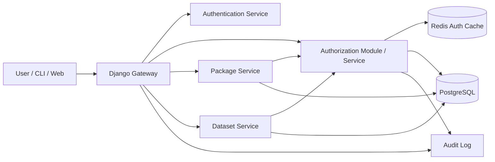
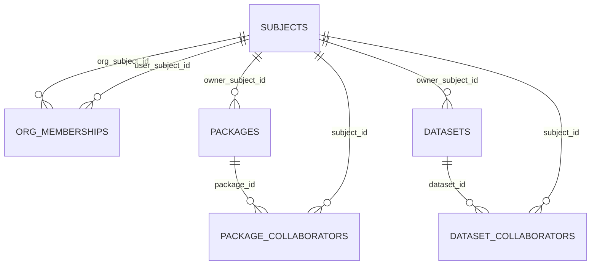
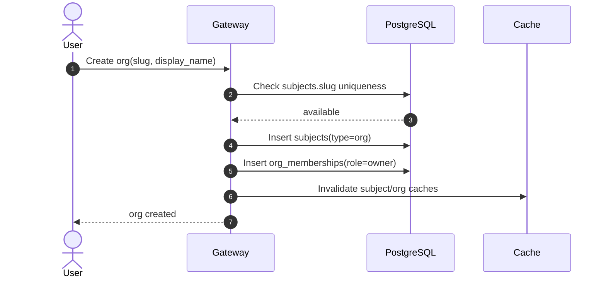
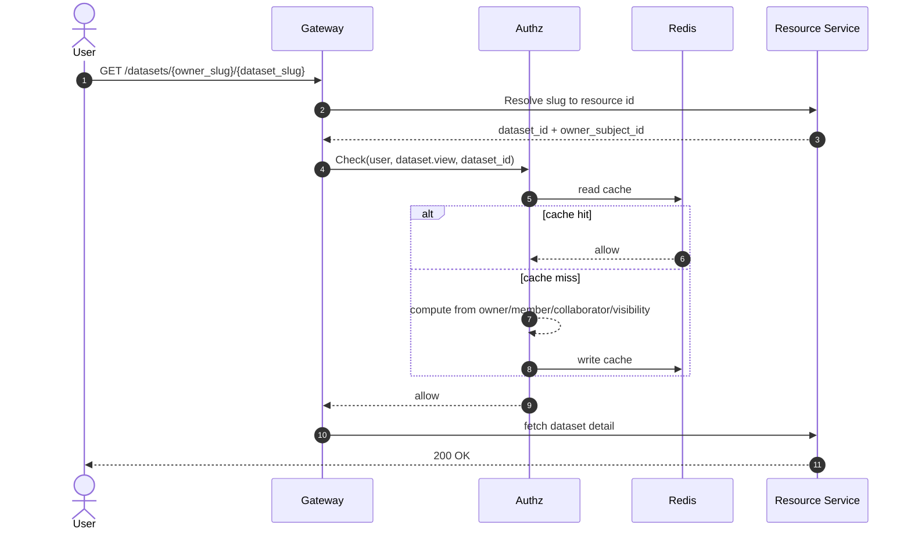
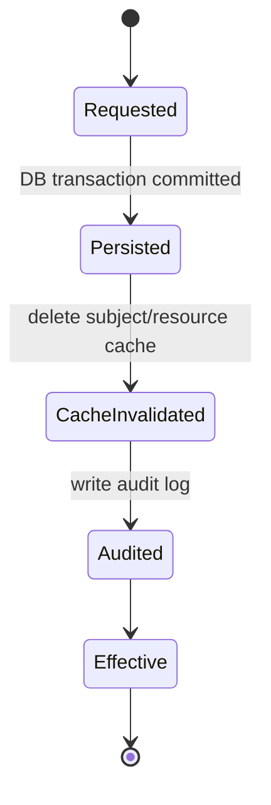

# 用户、组织与权限系统技术方案

> 适用范围：DCAI 平台的 User / Organization / Authentication / Authorization 体系设计  
> 目标：在 AI Coding 快速迭代模式下，为 Packages、Datasets 及后续 Models / Apps 提供统一、可扩展、可审计的权限基础设施  
> 参考基线：[docs/dcai_authorization_design-zh.md](/home/linpengt/workspace/dcai-platform/docs/dcai_authorization_design-zh.md)

---

## 1. 文档目标与设计原则

本方案将现有授权设计与新需求合并，沉淀为可直接进入开发评审的结构化文档，并按照分层技术评审体系组织：

1. 架构层：系统架构、安全设计、性能指标
2. 接口层：OpenAPI 规范、错误码定义
3. 数据层：数据模型 DDL、索引策略
4. 业务层：核心业务流程、状态机设计
5. 质量层：代码规范、测试策略

设计原则：

- User 与 Organization 共享全局命名空间
- 统一主体模型，内部以 `subject` 抽象身份
- 统一资源所有权模型，资源只认 `owner_subject_id`
- 统一权限语义，业务服务不散落实现权限规则
- 个人资源支持协作者，组织资源通过组织成员角色继承权限
- URL 使用 slug，授权与存储内部使用稳定 ID
- 细粒度资源权限不写入长期 token
- 列表权限结果允许使用 Redis 缓存，但权限变更必须强制失效

---

## 2. 总体结论

建议采用三层身份与权限体系：

1. Authentication
   负责用户登录、Token 签发、内部 Token Exchange、Session 管理
2. Authorization
   负责统一判断 `subject` 是否可对 `resource` 执行 `action`
3. Resource Services
   负责 Packages、Datasets 等资源元数据与业务逻辑，不自行发明权限模型

核心结论：

- 用户、组织、未来的 service account 都进入统一 `subjects` 表
- Packages、Datasets 共享一致的 owner / visibility / collaborator 模式
- 组织资源权限继承自 `org_memberships`
- 个人资源才允许 `*_collaborators`
- Django Gateway 作为入口层做认证、粗鉴权和 token exchange
- 下游 Resource Service 做资源级鉴权
- 鉴权结果支持 Redis 缓存，变更时按 subject 和 resource 维度精确失效

---

## 3. 架构层评审

### 3.1 系统架构



职责划分：

- Django Gateway
  - 校验用户 Access Token
  - 解析 active org 上下文
  - 处理 slug 到内部 ID 的入口解析
  - 在必要时签发内部短时 Token
- Authentication Service
  - 登录、刷新、注销、内部 Token Exchange
  - 提供稳定 `sub`
- Authorization Module / Service
  - 提供 `Check`、`CheckBulk`、`Expand`、`WriteTuples`
  - 对 Packages / Datasets 使用统一规则
- Package / Dataset Service
  - 管理资源元数据
  - 对详情、修改、删除、列表执行资源级鉴权
- Redis Auth Cache
  - 缓存用户可见资源集合与 `CheckBulk` 结果
- PostgreSQL
  - 身份、成员关系、资源元数据、协作者与审计真相源

### 3.2 统一身份与所有权模型

统一主体：

- `subject.type = user | org`
- 后续可扩展 `service_account | api_key`

统一所有权：

- `packages.owner_subject_id`
- `datasets.owner_subject_id`

统一 URL：

- Package: `/{owner_slug}/{package_slug}`
- Dataset: `/datasets/{owner_slug}/{dataset_slug}`

统一动作语义：

- `package.view | edit | admin | delete | transfer`
- `dataset.view | edit | admin | delete | transfer`

### 3.3 安全设计

认证与授权边界：

- Access Token 仅承载身份上下文与粗粒度 scope
- 资源级权限必须通过统一授权层计算
- 内部服务只信任内部签发链，不直接信任外部 Access Token
- 高风险操作可以强制实时回源，不信任缓存

安全约束：

- `sub` 必须使用稳定 ID，不使用 slug
- slug 仅用于 URL 与展示，允许改名
- 组织切换必须显式携带 `active_org_id`
- 资源转移 owner 时必须触发缓存失效与审计记录
- 协作者仅允许挂载在个人资源，组织资源禁止直配 collaborator

### 3.4 性能指标

建议目标：

- 单次 `Check` p95 < 20ms
- 单次 `CheckBulk(100)` p95 < 80ms
- 列表页“我可见的 packages/datasets”命中缓存时 p95 < 30ms
- 权限变更后的缓存失效传播时间 < 3s
- 高风险操作默认绕过缓存或采用二次校验

### 3.5 缓存设计

推荐缓存项：

- `authz:visible:packages:{subject_id}`
- `authz:visible:datasets:{subject_id}`
- `authz:check:{subject_id}:{action}:{resource_type}:{resource_id}`
- `authz:subject-orgs:{subject_id}`

失效触发器：

- Organization 成员新增、删除、角色变化
- Package / Dataset owner 变更
- Package / Dataset visibility 变更
- Package / Dataset collaborator 增删改
- Subject slug 修改

失效策略：

- 优先按 subject 维度删除可见资源集合缓存
- 按 resource 维度删除单资源鉴权缓存
- 对高风险操作设置 `no-cache` 检查路径

---

## 4. 接口层评审

### 4.1 OpenAPI 风格接口清单

认证接口：

- `POST /api/v1/auth/login`
- `POST /api/v1/auth/refresh`
- `POST /api/v1/auth/token-exchange`
- `POST /api/v1/auth/logout`

身份与组织接口：

- `GET /api/v1/me`
- `GET /api/v1/orgs/{org_slug}`
- `POST /api/v1/orgs`
- `POST /api/v1/orgs/{org_slug}/members`
- `PATCH /api/v1/orgs/{org_slug}/members/{user_id}`
- `DELETE /api/v1/orgs/{org_slug}/members/{user_id}`

Package / Dataset 权限相关接口：

- `GET /api/v1/packages/{owner_slug}/{package_slug}`
- `PATCH /api/v1/packages/{owner_slug}/{package_slug}`
- `GET /api/v1/datasets/{owner_slug}/{dataset_slug}`
- `PATCH /api/v1/datasets/{owner_slug}/{dataset_slug}`
- `POST /api/v1/packages/{owner_slug}/{package_slug}/collaborators`
- `POST /api/v1/datasets/{owner_slug}/{dataset_slug}/collaborators`

统一授权接口：

- `POST /api/v1/authz/check`
- `POST /api/v1/authz/check-bulk`
- `POST /api/v1/authz/expand`
- `POST /api/v1/authz/tuples:write`

### 4.2 关键接口契约

#### `POST /api/v1/authz/check`

```json
{
  "subject": {
    "type": "user",
    "id": "usr_123"
  },
  "action": "dataset.edit",
  "resource": {
    "type": "dataset",
    "id": "dts_456"
  },
  "context": {
    "active_org_id": "org_789",
    "skip_cache": false
  }
}
```

```json
{
  "allowed": true,
  "reason": "org_write_member",
  "from_cache": true
}
```

#### `POST /api/v1/authz/check-bulk`

```json
{
  "subject": {
    "type": "user",
    "id": "usr_123"
  },
  "action": "package.view",
  "resources": [
    {"type": "package", "id": "pkg_1"},
    {"type": "package", "id": "pkg_2"}
  ]
}
```

```json
{
  "results": [
    {"resource_id": "pkg_1", "allowed": true},
    {"resource_id": "pkg_2", "allowed": false}
  ]
}
```

#### `POST /api/v1/orgs/{org_slug}/members`

```json
{
  "user_id": "usr_123",
  "role": "write"
}
```

### 4.3 错误码定义

建议统一错误码前缀：

- 认证：`AUTH_*`
- 授权：`AUTHZ_*`
- 组织：`ORG_*`
- 资源：`PKG_*`、`DATASET_*`

错误码表：

| 错误码 | HTTP | 含义 |
| --- | --- | --- |
| `AUTH_INVALID_TOKEN` | 401 | Token 无效或过期 |
| `AUTH_TOKEN_AUDIENCE_DENIED` | 403 | Token audience 不匹配 |
| `AUTHZ_PERMISSION_DENIED` | 403 | 当前主体无资源权限 |
| `AUTHZ_RESOURCE_BOUND_MISMATCH` | 403 | capability token 与请求资源不匹配 |
| `ORG_SLUG_CONFLICT` | 409 | 组织 slug 与现有 user/org 冲突 |
| `ORG_MEMBER_ALREADY_EXISTS` | 409 | 成员已存在 |
| `ORG_LAST_OWNER_FORBIDDEN` | 400 | 不允许移除最后一个 owner |
| `RESOURCE_SLUG_CONFLICT` | 409 | owner 下资源 slug 冲突 |
| `COLLABORATOR_NOT_ALLOWED_FOR_ORG_RESOURCE` | 400 | 组织资源不允许协作者 |
| `RESOURCE_TRANSFER_FORBIDDEN` | 403 | 无 owner/admin 权限执行转移 |

### 4.4 接口规范要求

- 所有资源接口先解析 slug，再基于内部 ID 鉴权
- 列表接口必须提供批量鉴权路径，禁止逐条 `Check`
- 高风险接口支持 `skip_cache=true`
- 所有 403 响应统一返回 `code + message + request_id`
- OpenAPI 中显式标注哪些接口需要 `active_org_id`

---

## 5. 数据层评审

### 5.1 数据模型



### 5.2 DDL 建议

```sql
CREATE TABLE subjects (
    id VARCHAR(64) PRIMARY KEY,
    type VARCHAR(16) NOT NULL CHECK (type IN ('user', 'org')),
    slug VARCHAR(128) NOT NULL,
    display_name VARCHAR(255) NOT NULL,
    status VARCHAR(16) NOT NULL DEFAULT 'active',
    created_at TIMESTAMPTZ NOT NULL DEFAULT NOW(),
    updated_at TIMESTAMPTZ NOT NULL DEFAULT NOW(),
    UNIQUE (slug)
);

CREATE TABLE org_memberships (
    id BIGSERIAL PRIMARY KEY,
    org_subject_id VARCHAR(64) NOT NULL REFERENCES subjects(id),
    user_subject_id VARCHAR(64) NOT NULL REFERENCES subjects(id),
    role VARCHAR(16) NOT NULL CHECK (role IN ('owner', 'admin', 'write', 'read')),
    created_at TIMESTAMPTZ NOT NULL DEFAULT NOW(),
    updated_at TIMESTAMPTZ NOT NULL DEFAULT NOW(),
    UNIQUE (org_subject_id, user_subject_id)
);

CREATE TABLE packages (
    id VARCHAR(64) PRIMARY KEY,
    owner_subject_id VARCHAR(64) NOT NULL REFERENCES subjects(id),
    slug VARCHAR(128) NOT NULL,
    visibility VARCHAR(16) NOT NULL CHECK (visibility IN ('private', 'internal', 'public')),
    created_by_subject_id VARCHAR(64) NOT NULL REFERENCES subjects(id),
    created_at TIMESTAMPTZ NOT NULL DEFAULT NOW(),
    updated_at TIMESTAMPTZ NOT NULL DEFAULT NOW(),
    UNIQUE (owner_subject_id, slug)
);

CREATE TABLE package_collaborators (
    id BIGSERIAL PRIMARY KEY,
    package_id VARCHAR(64) NOT NULL REFERENCES packages(id) ON DELETE CASCADE,
    subject_id VARCHAR(64) NOT NULL REFERENCES subjects(id),
    role VARCHAR(16) NOT NULL CHECK (role IN ('read', 'write')),
    created_at TIMESTAMPTZ NOT NULL DEFAULT NOW(),
    updated_at TIMESTAMPTZ NOT NULL DEFAULT NOW(),
    UNIQUE (package_id, subject_id)
);

CREATE TABLE datasets (
    id VARCHAR(64) PRIMARY KEY,
    owner_subject_id VARCHAR(64) NOT NULL REFERENCES subjects(id),
    slug VARCHAR(128) NOT NULL,
    visibility VARCHAR(16) NOT NULL CHECK (visibility IN ('private', 'internal', 'public')),
    created_by_subject_id VARCHAR(64) NOT NULL REFERENCES subjects(id),
    created_at TIMESTAMPTZ NOT NULL DEFAULT NOW(),
    updated_at TIMESTAMPTZ NOT NULL DEFAULT NOW(),
    UNIQUE (owner_subject_id, slug)
);

CREATE TABLE dataset_collaborators (
    id BIGSERIAL PRIMARY KEY,
    dataset_id VARCHAR(64) NOT NULL REFERENCES datasets(id) ON DELETE CASCADE,
    subject_id VARCHAR(64) NOT NULL REFERENCES subjects(id),
    role VARCHAR(16) NOT NULL CHECK (role IN ('read', 'write')),
    created_at TIMESTAMPTZ NOT NULL DEFAULT NOW(),
    updated_at TIMESTAMPTZ NOT NULL DEFAULT NOW(),
    UNIQUE (dataset_id, subject_id)
);
```

### 5.3 索引策略

建议索引：

```sql
CREATE UNIQUE INDEX idx_subjects_slug ON subjects(slug);
CREATE INDEX idx_org_memberships_user_role ON org_memberships(user_subject_id, role);
CREATE INDEX idx_org_memberships_org_role ON org_memberships(org_subject_id, role);
CREATE INDEX idx_packages_owner_visibility ON packages(owner_subject_id, visibility);
CREATE INDEX idx_datasets_owner_visibility ON datasets(owner_subject_id, visibility);
CREATE INDEX idx_pkg_collab_subject_role ON package_collaborators(subject_id, role);
CREATE INDEX idx_dataset_collab_subject_role ON dataset_collaborators(subject_id, role);
```

索引原则：

- 全局命名空间冲突检查依赖 `subjects.slug` 唯一索引
- 资源解析路径依赖 `(owner_subject_id, slug)` 唯一约束
- 列表可见性与 owner 组合过滤依赖 owner + visibility 索引
- 可见资源集合计算依赖 collaborator 与 membership 的反向索引

### 5.4 统一关系模型演进

当前阶段建议保留业务友好的 collaborator 表，同时在设计上预留迁移到 `relation_tuples`：

- 早期：`org_memberships + package_collaborators + dataset_collaborators`
- 中期：授权模块内部抽象为统一关系图
- 后期：可演进到独立 `relation_tuples`

---

## 6. 业务层评审

### 6.1 权限语义

组织角色：

- `owner`
- `admin`
- `write`
- `read`

个人资源协作者角色：

- `read`
- `write`

资源权限映射：

| 动作 | 个人 owner | 个人 collaborator(write) | 个人 collaborator(read) | org owner/admin | org write | org read |
| --- | --- | --- | --- | --- | --- | --- |
| `view` | yes | yes | yes | yes | yes | yes |
| `edit` | yes | yes | no | yes | yes | no |
| `admin` | yes | no | no | yes | no | no |
| `delete` | yes | no | no | yes | no | no |
| `transfer` | yes | no | no | yes | no | no |

### 6.2 核心业务规则

命名空间规则：

- user 与 org 共享 `subjects.slug`
- `alice` 不能同时是 user 和 org

资源 ownership 规则：

- 资源 owner 只能是一个 `subject`
- owner 为 `user` 时允许配置 collaborator
- owner 为 `org` 时禁止 collaborator，统一走 org membership

可见性规则：

- `private` 仅 owner / 继承权限 / collaborator 可见
- `internal` 平台登录用户可见，编辑仍走资源权限
- `public` 匿名可见，修改仍走资源权限

### 6.3 核心流程

#### 创建组织



#### 访问资源



#### 权限变更



### 6.4 状态机设计

#### 组织成员关系状态

简化状态：

- `active`
- `removed`

规则：

- 新成员写入后直接 `active`
- 删除成员转为 `removed` 或物理删除
- 最后一个 `owner` 不可降级、不可删除

#### 资源授权变更状态

简化状态：

- `pending`
- `effective`
- `failed`

适用场景：

- owner transfer
- collaborator 变更
- visibility 变更
- org role 变更

要求：

- 变更成功必须伴随缓存失效
- 若缓存失效失败，操作标记 `failed` 并进入补偿队列

---

## 7. 质量层评审

### 7.1 代码规范

- 认证、授权、资源服务的权限逻辑必须收口到统一模块
- 禁止在 View / Controller 中散落硬编码角色判断
- 所有资源鉴权调用统一使用 `Check` / `CheckBulk`
- 列表接口必须先考虑批量鉴权与缓存命中路径
- 高风险操作显式标注 `skip_cache` 策略

### 7.2 测试策略

单元测试：

- `subjects.slug` 全局唯一性
- `org_memberships` 角色继承
- 个人资源 collaborator 生效
- 组织资源禁止 collaborator
- `visibility` 与继承权限的组合判断

集成测试：

- Django Gateway -> Authz -> Resource Service 正常链路
- token exchange 后下游资源访问
- owner transfer 后旧 owner 权限消失
- 成员降级后缓存失效
- `CheckBulk` 与列表结果一致

回归测试矩阵：

| 场景 | 预期 |
| --- | --- |
| 用户访问自己的 private package | 允许 |
| 非成员访问组织 private dataset | 拒绝 |
| org write 成员编辑 org dataset | 允许 |
| org read 成员编辑 org dataset | 拒绝 |
| collaborator(write) 编辑个人 package | 允许 |
| collaborator(read) 删除个人 package | 拒绝 |
| 组织资源添加 collaborator | 拒绝 |
| slug 改名后旧缓存命中 | 不允许，必须失效 |

### 7.3 Code Review 清单

- 是否使用统一 `subject` 与 `owner_subject_id`
- 是否误把 slug 当作稳定身份主键
- 是否在组织资源上引入了 collaborator
- 是否为列表页实现了批量鉴权
- 是否定义了权限变更后的缓存失效路径
- 是否对最后一个 org owner 做了保护
- 是否为高风险操作保留实时鉴权路径

---

## 8. 分阶段落地建议

### Phase 1

- 落地 `subjects`、`org_memberships`、`packages`、`datasets`
- 落地 collaborator 表
- 在 Django 内实现统一 authz module
- Resource Service 接统一 `Check` / `CheckBulk`
- Redis 缓存仅覆盖可见资源列表与单资源 check

### Phase 2

- 抽象 relation graph
- 增加 `Expand`、`WriteTuples`
- 权限变更事件化，支持异步缓存失效与审计

### Phase 3

- 视微服务规模拆分独立 Authorization Service
- 演进到 `relation_tuples`
- 支持更多资源类型：models / apps / spaces / service accounts

---

## 9. 最终建议

这套方案的核心不是“多加几张权限表”，而是统一平台的身份、所有权和授权语义：

- User 与 Organization 共享命名空间
- 内部统一为 `subject`
- 资源统一认 `owner_subject_id`
- 个人资源支持 collaborator，组织资源继承 org membership
- 资源权限通过统一授权层动态计算
- Redis 只做加速层，不做权限真相源

一句话总结：

> 用 `subject + owner_subject_id + org_memberships + collaborators + unified authz` 构建 HuggingFace 风格的用户与组织权限体系，并以结构化文档沉淀为 AI 开发与评审的统一依据。
