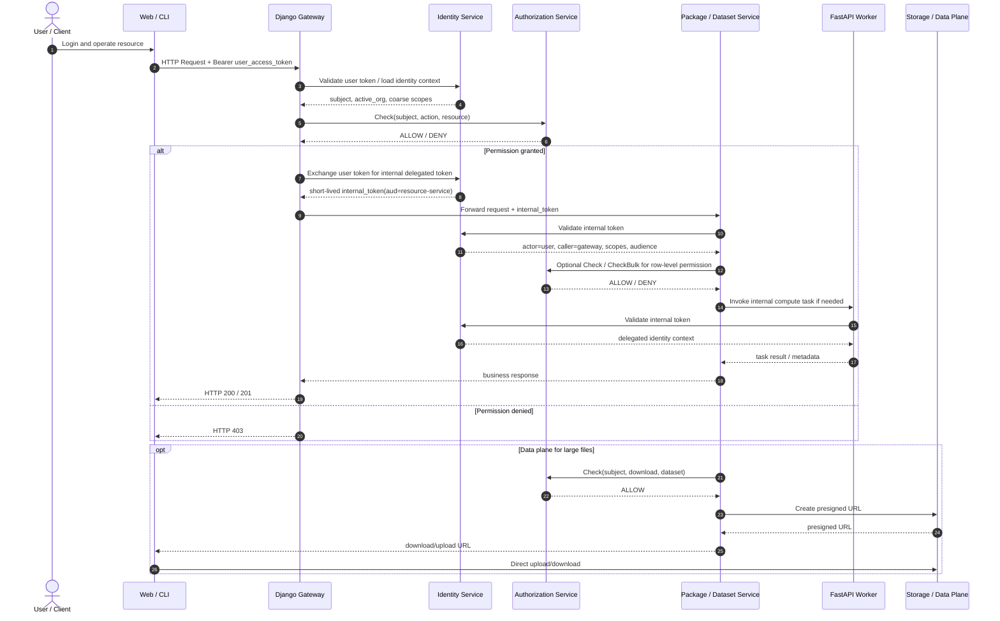

# 面向 HuggingFace 风格资源平台的权限模型设计

> 目标：在多微服务架构下，为 Package、Dataset 等资源提供统一所有权模型、组织继承权限、协作者机制，以及可扩展到 Zanzibar 风格的授权体系。

---

## 1. 设计结论

结论先行：

1. 需要统一的身份服务（Authentication / IdP）
2. 最好有统一的授权判定层（Authorization）
3. 不要把细粒度资源权限直接塞进 token
4. 资源服务负责资源元数据，权限服务负责回答“谁能对什么做什么”

其中：

- 身份服务负责登录、签发用户 token、签发服务间 token、token exchange
- 授权层负责统一计算 `view`、`edit`、`admin` 等权限
- 资源服务负责 Package、Dataset 等资源的业务逻辑
- 关系存储负责维护 user、org、resource 之间的关系 tuple

这和 Zanzibar 的核心思想一致：把授权问题抽象为关系计算，而不是散落在各个微服务里写 if/else。

---

## 2. 参考 HuggingFace 的核心权限模型

参考 HuggingFace 的 User / Organization / Repository 模式，可以提炼出以下稳定抽象：

### 2.1 统一命名空间

- `user.slug` 和 `org.slug` 共用全局唯一命名空间
- 资源 URL 基于 `owner_slug` 进行寻址

示例：

- Package: `/{owner_slug}/{package_slug}`
- Dataset: `/datasets/{owner_slug}/{dataset_slug}`

### 2.2 统一所有权

资源不区分“用户资源表”和“组织资源表”，统一使用 owner 指向主体：

- 用户可以拥有 Package / Dataset
- 组织也可以拥有 Package / Dataset

### 2.3 组织成员继承权限

组织资源的权限来源于组织成员关系：

- `owner`
- `admin`
- `write`
- `read`

也就是说，组织资源不需要再对每个成员逐个写 ACL，组织成员角色天然继承到资源上。

### 2.4 协作者机制

个人资源通常还需要额外支持协作者：

- 用户拥有的资源，可以单独授予其他用户 `read` / `write`
- 组织拥有的资源，优先通过组织成员关系授权

---

## 3. 主体与资源的统一抽象

相比 `owner_type + owner_id`，更建议使用统一 `subject` 抽象。

### 3.1 Subject

```text
subject
- id
- type: user | org | service_account | api_key
- slug
- display_name
- status
```

优点：

- user 和 org 都可以成为 owner
- 后续可以自然扩展 service account、机器身份、机器人账号
- 授权模型不再依赖大量 `if owner_type == ...`

### 3.2 Resource

```text
package
- id
- owner_subject_id
- slug
- visibility
- created_by
- created_at

dataset
- id
- owner_subject_id
- slug
- visibility
- created_by
- created_at
```

其中：

- `owner_subject_id` 指向统一 `subject`
- `visibility` 可取 `private | internal | public`

---

## 4. 关系模型：向 Zanzibar 靠拢

如果只是做单体系统，`package_collaborators`、`dataset_collaborators` 也能工作。

但如果目标是多微服务统一授权，建议把权限关系统一表达为 relation tuple。

### 4.1 关系示例

```text
org:acme#owner@user:alice
org:acme#admin@user:bob
org:acme#write@user:charlie
org:acme#read@user:david

package:acme/pkg1#owner@org:acme
package:alice/pkg2#owner@user:alice
package:alice/pkg2#collaborator_write@user:bob

dataset:acme/ds1#owner@org:acme
dataset:alice/ds2#collaborator_read@user:charlie
```

### 4.2 统一权限语义

推荐定义资源层权限，而不是把角色直接暴露给所有业务模块：

- `view`
- `edit`
- `admin`
- `delete`
- `transfer`

通过规则映射：

```text
package.view =
  public
  or owner
  or collaborator_read
  or collaborator_write
  or owner_org.read
  or owner_org.write
  or owner_org.admin
  or owner_org.owner

package.edit =
  owner
  or collaborator_write
  or owner_org.write
  or owner_org.admin
  or owner_org.owner

package.admin =
  owner
  or owner_org.admin
  or owner_org.owner
```

`dataset.*` 沿用同样的规则即可。

这样“组织资源继承组织成员权限”会由关系图自然表达，不需要每个服务各写一套推导逻辑。

---

## 5. 是否需要统一权限服务

短答案：最终最好有，初期不一定要独立部署。

### 5.1 不建议的做法

每个微服务都自己维护：

- 一套成员关系表
- 一套资源 ACL 表
- 一套权限判断逻辑

这种做法短期快，长期一定分叉，常见问题包括：

- Package 和 Dataset 的权限语义不一致
- 撤权后某些服务缓存未失效
- 列表接口和详情接口判断标准不同
- 新增角色时需要全链路重复改造

### 5.2 推荐的分阶段落地

#### Phase 1：统一授权库

先不拆服务，在 Django 主后端内实现统一授权模块：

```text
check(subject, action, resource) -> allow / deny
check_bulk(subject, action, resources[]) -> batch result
```

所有资源服务都调用同一套授权逻辑。

#### Phase 2：授权数据独立

把关系 tuple 和缓存独立出来，授权模块提供统一 API：

- `Check`
- `CheckBulk`
- `Expand`
- `WriteTuple`

#### Phase 3：独立权限服务

当微服务数量、资源类型、权限关系复杂度明显上升后，再拆成真正的授权中心服务。

换句话说：

- `统一权限模型` 是必须的
- `统一权限服务进程` 不是第一天必须，但最终大概率会需要

---

## 6. Token 应该承载什么

token 只应携带身份上下文和粗粒度 scope，不应携带完整资源 ACL。

### 6.1 推荐放进 token 的内容

```json
{
  "sub": "user_123",
  "sid": "session_abc",
  "org_id": "org_456",
  "scp": ["packages:read", "datasets:write"],
  "aud": "gateway",
  "azp": "web-client",
  "act": {
    "sub": "gateway"
  },
  "iat": 1710000000,
  "exp": 1710000600,
  "jti": "token-id"
}
```

字段解释：

- `sub`: 当前用户或主体 ID
- `org_id`: 当前激活组织上下文
- `scp`: 粗粒度能力范围
- `aud`: token 目标服务
- `azp`: 发起调用的客户端
- `act`: 代理链中的行动者
- `exp`: 短生命周期过期时间

### 6.2 不建议放进 token 的内容

不要把下面这些直接编码进 token：

- 某个用户拥有的全部 package 列表
- 某个用户所在组织的完整成员关系
- 某个用户对每个 dataset 的细粒度 ACL

原因：

- token 体积会迅速膨胀
- 撤权不及时
- 微服务侧难以处理复杂继承关系
- 无法支持列表页批量鉴权优化

因此，细粒度资源权限应通过授权层查询得到，而不是通过 token claim 推断。

### 6.3 FastAPI 只验证内部 token 的含义

FastAPI 只验证内部 token，指的是它首先确认：

- 这次调用来自可信上游服务
- 这个 token 是平台内部签发的短时委托 token
- token 的 `aud`、`scp`、`act`、`sub` 等 claim 合法

但这不等于已经完成了资源级授权。

内部 token 只能证明：

- 谁在调用
- 代表谁调用
- 被允许调用哪个服务
- 拥有哪些粗粒度 scope

它不能单独证明：

- 当前用户是否可以编辑某个具体 dataset
- 当前用户是否仍然是某个 org 的成员
- 当前用户是否拥有某个 package 的协作者权限

因此：

- `内部 token = 身份与委托上下文`
- `统一授权接口 = 细粒度资源权限判定`

### 6.4 允许短时 token 作为资源级授权票据

为了避免在短时间窗口内反复调用统一授权接口，可以允许一种更严格的短时 token：

- `delegated capability token`
- 或 `resource-bound token`

这种 token 和普通 access token 的区别在于，它不是泛化身份凭证，而是明确绑定：

- 目标资源
- 允许动作
- 目标服务
- 极短有效期

示例：

```json
{
  "sub": "user_123",
  "act": {"sub": "django-gateway"},
  "aud": "dataset-service",
  "resource": {
    "type": "dataset",
    "id": "ds_456"
  },
  "actions": ["dataset.edit"],
  "purpose": "delegated_resource_access",
  "iat": 1710000000,
  "exp": 1710000030,
  "jti": "cap_token_1"
}
```

推荐约束：

- `exp - iat` 尽量短，建议 30 秒到 5 分钟
- `aud` 必须是单个下游服务
- `resource.id` 必须明确
- `actions` 必须是明确动作，而不是粗粒度 scope
- token 应为一次请求或一小段连续操作服务，而不是长期复用

因此可以形成两类策略：

- 普通内部 token：
  - 只表达身份与粗 scope
  - 不能跳过资源级授权检查
- 短时资源绑定 token：
  - 已包含具体资源和动作授权
  - 在有效期内可跳过重复的实时鉴权查询

这样做的目标不是取消授权服务，而是减少短窗口内的重复授权调用。

---

## 7. Django + FastAPI 的落地调用链

推荐采用“双层 token”：

1. 前端持有用户访问 token
2. Django Gateway 校验后，为下游 FastAPI 换发短时内部委托 token

这样做有几个好处：

- 下游服务只信任内部签发链
- 可以收窄 `audience`
- 可以把原始用户身份和代理服务身份同时编码进去
- token 泄露风险更低

### 7.1 请求调用链



### 7.2 授权判断责任划分

- Django Gateway:
  - 校验前端 token
  - 做入口级粗鉴权
  - 执行 token exchange
  - 控制对下游服务的转发
- Authorization Service:
  - 维护关系 tuple
  - 统一实现 `Check / CheckBulk / Expand`
- Package / Dataset Service:
  - 管理资源元数据
  - 在列表、详情、修改等场景执行细粒度鉴权
- FastAPI Worker:
  - 不自行实现复杂资源授权规则
  - 仅消费 Gateway 下发的委托身份，必要时回查授权服务

### 7.3 FastAPI 什么时候要调用统一授权接口

原则很简单：

- 如果 FastAPI 只执行纯内部计算任务，可以只验证内部 token
- 如果 FastAPI 直接读取、修改、删除、列举资源，就应调用统一授权接口

#### 可以只验证内部 token 的场景

- 文本转换、格式转换、文件转码
- 模型推理执行
- 异步任务 worker 的纯计算步骤
- 已由 Gateway 完成完整资源鉴权，而下游只负责执行的内部 RPC

这些场景里，FastAPI 不直接决定“用户能否访问某资源”，它只是执行已授权任务。

#### 必须回查统一授权接口的场景

- 读取单个资源详情前
  - 如 `GET /datasets/{id}`
- 修改资源前
  - 如 `PATCH /packages/{id}`
- 删除、转移所有权、修改可见性前
  - 如 `DELETE /datasets/{id}`
- 列表页需要按权限过滤时
  - 如“列出我可见的 packages”
- 异步任务真正开始消费资源前
  - 如训练任务启动前校验 dataset 读取权限
- 跨资源组合操作前
  - 如“使用 dataset A 构建 package B”

判断标准可以简化为一句话：

> FastAPI 是否知道并直接操作资源对象。如果知道，就应该查统一授权接口。

#### 可以跳过重复检查的例外场景

如果上游已经完成强校验，并签发了短时资源绑定 token，则下游可以在 token 有效期内跳过重复调用统一授权接口。

典型条件：

- Django Gateway 已经调用过 `Check`
- Django Gateway 为特定资源和动作签发了短时 token
- token 中明确包含 `resource.id` 和 `actions`
- token 的 `aud` 仅允许目标 FastAPI 服务使用
- token TTL 很短，通常不超过几分钟

示例场景：

- 用户刚通过 Django 校验，准备连续对 `dataset:ds_456` 发起多次 patch
- Django 先检查一次 `dataset.edit`
- 然后给 `dataset-service` 签发一个 60 秒有效的 `dataset.edit@ds_456` token
- FastAPI 在 60 秒窗口内只验证该 token，不再重复查 `authz/check`

这种优化适用于：

- 高频小步编辑
- 前端自动保存
- 多段上传/分片确认
- 短时间内的多次内部 RPC

但不适用于：

- 长生命周期 access token
- 未绑定具体资源的 scope token
- 组织成员关系可能高频变化且要求强实时撤权的高风险操作

### 7.4 三类 token 的职责边界

建议区分三类 token：

| Token 类型 | 用途 | 是否可替代实时授权检查 | 推荐 TTL |
| ---------- | ---- | ---------------------- | -------- |
| Access Token | 用户登录态、前端访问平台 | 否 | 5 分钟到 1 小时 |
| Delegated Internal Token | Django 到下游服务的内部委托身份 | 否，默认不能 | 1 到 10 分钟 |
| Resource-Bound Capability Token | 针对具体资源与动作的短时授权票据 | 可以，在短窗口内允许 | 30 秒到 5 分钟 |

推荐原则：

- 默认使用 `Access Token` 和 `Delegated Internal Token`
- 只有明确需要减少重复鉴权时，才引入 `Resource-Bound Capability Token`
- capability token 必须绑定资源和动作，不能只是 `dataset.update` 这种泛化权限

### 7.5 推荐的责任分层

- Django Gateway
  - 负责入口认证
  - 做粗粒度授权
  - 执行 token exchange
  - 向下游传递短时内部 token
- FastAPI Resource Service
  - 负责资源元数据读写
  - 在资源级操作前调用统一授权接口
- FastAPI Worker
  - 默认只验证内部 token
  - 只有在真正读取或修改资源时才调用统一授权接口

这样可以避免两个极端：

- 极端一：所有服务都自己写资源权限逻辑
- 极端二：下游服务完全不做资源级保护，误信上游

---

## 8. 统一授权接口设计

统一授权接口的目标不是替代业务 API，而是向业务服务回答一个标准问题：

> 某主体是否可以对某资源执行某动作？

### 8.1 Check

用于单资源单动作判定。

```http
POST /authz/check
Authorization: Bearer <internal_service_token>
Content-Type: application/json
```

请求体：

```json
{
  "subject": {
    "type": "user",
    "id": "user_123"
  },
  "action": "dataset.edit",
  "resource": {
    "type": "dataset",
    "id": "ds_456"
  },
  "context": {
    "active_org_id": "org_789"
  }
}
```

返回：

```json
{
  "allowed": true,
  "reason": "org_write_member"
}
```

适用场景：

- 详情页
- 更新接口
- 删除接口
- capability token 签发前的上游强校验

### 8.2 CheckBulk

用于列表页和批量资源判定，避免 N+1。

```http
POST /authz/check-bulk
Authorization: Bearer <internal_service_token>
Content-Type: application/json
```

请求体：

```json
{
  "subject": {
    "type": "user",
    "id": "user_123"
  },
  "action": "dataset.view",
  "resources": [
    {"type": "dataset", "id": "ds_1"},
    {"type": "dataset", "id": "ds_2"}
  ],
  "context": {
    "active_org_id": "org_789"
  }
}
```

返回：

```json
{
  "results": [
    {"resource_id": "ds_1", "allowed": true},
    {"resource_id": "ds_2", "allowed": false}
  ]
}
```

适用场景：

- 列表页
- 搜索页
- 批量删除前预检查

### 8.3 Expand

反向展开某个资源的某权限对应的主体集合。

```http
POST /authz/expand
Authorization: Bearer <internal_service_token>
Content-Type: application/json
```

请求体：

```json
{
  "resource": {
    "type": "package",
    "id": "pkg_1"
  },
  "permission": "package.admin"
}
```

返回：

```json
{
  "subjects": [
    {"type": "user", "id": "user_1"},
    {"type": "org", "id": "org_1"}
  ]
}
```

适用场景：

- 管理台展示“谁有权限”
- 审计
- 调试

### 8.4 WriteTuples

用于写入关系 tuple。

```http
POST /authz/tuples:write
Authorization: Bearer <internal_service_token>
Content-Type: application/json
```

请求体：

```json
{
  "writes": [
    {
      "resource": "package:alice/pkg1",
      "relation": "collaborator_write",
      "subject": "user:bob"
    }
  ],
  "deletes": []
}
```

适用场景：

- 添加协作者
- 删除协作者
- 更新组织成员角色
- 转移资源 owner

### 8.5 ReadTuples

用于读取底层关系，主要面向调试和管理。

```http
POST /authz/tuples:read
Authorization: Bearer <internal_service_token>
Content-Type: application/json
```

请求体：

```json
{
  "resource": "package:alice/pkg1"
}
```

适用场景：

- 运维排查
- 审计导出
- 后台管理系统

### 8.6 可选接口：Resolve

如果 URL 语义大量基于 `owner_slug/resource_slug`，可以增加一个解析接口：

```http
POST /authz/resolve
```

请求体：

```json
{
  "resource_type": "dataset",
  "owner_slug": "acme",
  "resource_slug": "my-dataset",
  "action": "dataset.view",
  "subject": {
    "type": "user",
    "id": "user_123"
  }
}
```

它可以一步完成：

- 资源解析
- 授权检查
- 返回资源主键

适合对外 URL 层，但内部服务之间不一定必须使用。

---

## 9. FastAPI 调用统一授权接口的方式

推荐所有 FastAPI 资源服务都遵循两步：

1. 本地验证内部 token
2. 在资源操作前调用 `Check` 或 `CheckBulk`

伪代码如下：

```python
from fastapi import Depends, HTTPException


async def update_dataset(
    dataset_id: str,
    payload: dict,
    principal=Depends(validate_internal_token),
):
    authz_result = await authz_client.check(
        subject={
            "type": "user",
            "id": principal.user_id,
        },
        action="dataset.edit",
        resource={
            "type": "dataset",
            "id": dataset_id,
        },
        context={
            "active_org_id": principal.active_org_id,
        },
    )

    if not authz_result["allowed"]:
        raise HTTPException(status_code=403, detail="permission denied")

    return await dataset_service.update(dataset_id, payload)
```

列表页则优先使用 `CheckBulk`，不要对每条记录逐个调用 `Check`。

### 9.1 默认模式：验证 token + 调用 Check

这是默认推荐模式，适用于绝大多数资源操作：

```python
from fastapi import Depends, HTTPException


async def update_dataset(
    dataset_id: str,
    payload: dict,
    principal=Depends(validate_internal_token),
):
    authz_result = await authz_client.check(
        subject={
            "type": "user",
            "id": principal.user_id,
        },
        action="dataset.edit",
        resource={
            "type": "dataset",
            "id": dataset_id,
        },
        context={
            "active_org_id": principal.active_org_id,
        },
    )

    if not authz_result["allowed"]:
        raise HTTPException(status_code=403, detail="permission denied")

    return await dataset_service.update(dataset_id, payload)
```

### 9.2 优化模式：验证短时资源绑定 token，跳过重复 Check

如果 Django 已提前完成强校验，并为具体资源签发了 capability token，则 FastAPI 可以直接校验 token claim：

```python
from fastapi import Depends, HTTPException


async def update_dataset(
    dataset_id: str,
    payload: dict,
    principal=Depends(validate_resource_bound_token),
):
    if principal.resource_type != "dataset" or principal.resource_id != dataset_id:
        raise HTTPException(status_code=403, detail="resource mismatch")

    if "dataset.edit" not in principal.actions:
        raise HTTPException(status_code=403, detail="action mismatch")

    return await dataset_service.update(dataset_id, payload)
```

这种模式下的前提条件必须写死在规范里：

- token 必须是短时 token
- token 必须绑定单个资源
- token 必须绑定明确动作
- token 必须限制 `aud`
- token 只能用于减少短窗口内的重复鉴权，不作为长期授权替代

### 9.3 推荐决策规则

对资源修改接口，建议按如下顺序判断：

1. 如果收到的是普通内部 token：
   - 调用 `Check`
2. 如果收到的是资源绑定短时 token：
   - 校验 claim 是否匹配当前资源和动作
   - 匹配则可跳过重复 `Check`
3. 如果操作风险较高：
   - 即使是短时 token，也可强制重新调用 `Check`

高风险操作示例：

- 转移 owner
- 删除资源
- 修改组织级共享策略
- 修改计费、配额、发布状态

---

## 10. 数据表建议

### 8.1 Subject 与成员关系

```text
subjects
- id
- type
- slug
- display_name
- status
- created_at

org_memberships
- id
- org_subject_id
- user_subject_id
- role            // owner | admin | write | read
- created_at
- updated_at
```

### 8.2 资源元数据

```text
packages
- id
- owner_subject_id
- slug
- visibility
- created_by_subject_id
- created_at
- updated_at

datasets
- id
- owner_subject_id
- slug
- visibility
- created_by_subject_id
- created_at
- updated_at
```

### 8.3 协作者与关系表

如果还在早期阶段，可以先保留业务友好的 collaborator 表：

```text
package_collaborators
- package_id
- subject_id
- role            // read | write

dataset_collaborators
- dataset_id
- subject_id
- role            // read | write
```

但长期建议收敛为统一关系表：

```text
relation_tuples
- id
- namespace               // org | package | dataset
- object_key              // acme / acme/pkg1 / alice/ds2
- relation                // owner | admin | write | read | collaborator_write ...
- subject_namespace       // user | org | service_account
- subject_key             // alice / acme / bot-1
- condition_json          // optional
- created_at
```

这样后续增加：

- team
- service account
- API key principal
- 临时授权
- 条件授权

都不需要继续膨胀额外业务表。

---

## 11. 建议的权限判定接口

### 9.1 单条检查

```text
Check(subject, action, resource) -> allow / deny
```

示例：

```text
Check(user:alice, "package.edit", package:acme/pkg1)
```

### 9.2 批量检查

```text
CheckBulk(subject, action, resources[]) -> result[]
```

列表页、搜索页必须优先支持批量鉴权，否则会出现严重的 N+1 权限查询问题。

### 9.3 关系展开

```text
Expand(resource, permission) -> subjects[]
```

适用于：

- 管理台展示“谁有权限”
- 审计
- 调试

---

## 12. 实施建议

### 10.1 第一阶段建议

当前最务实的落地方式：

1. Django 继续作为统一登录入口
2. 新增统一 `subject` 概念
3. Package / Dataset 统一使用 `owner_subject_id`
4. 组织成员关系单独建模
5. 鉴权逻辑先收口到 Django 内的统一授权模块
6. FastAPI 只验证内部 token 和调用统一授权接口

### 10.2 第二阶段演进

当出现以下信号时，可以考虑独立授权服务：

- 微服务数量继续增长
- 资源类型超过 Package / Dataset / Model / Space
- 权限判断逻辑被多个服务重复实现
- 撤权实时性和审计要求明显提升

---

## 13. 最终建议

基于 HuggingFace 风格资源平台和 Zanzibar 授权思想，推荐采用以下原则：

- 用统一 `subject` 替代 `owner_type + owner_id`
- 用统一 `owner_subject_id` 表达个人与组织所有权
- 用组织成员关系表达组织资源继承权限
- 用协作者关系表达个人资源共享
- 用统一授权层回答资源权限问题
- 用短时内部委托 token 做 Django 到 FastAPI 的服务间身份传递
- 用批量鉴权和 presigned URL 支撑列表查询与大文件数据面

一句话总结：

> 认证要中心化，授权要统一化，细粒度权限不要硬编码进 token，而应通过关系模型动态计算。
