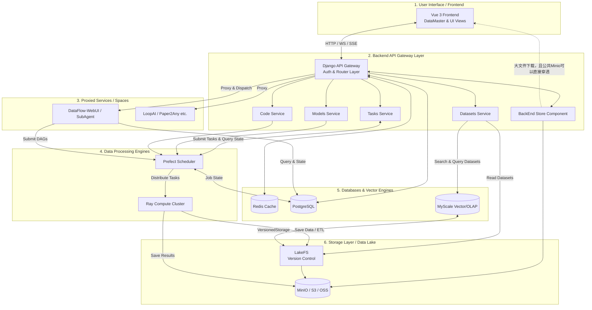

# DCAI 平台系统整体架构与模块接口设计文档

## 1. 架构愿景与系统概述

DCAI (Data-Centric AI) 平台是一个兼具模型浏览、数据集托管、智能体应用（Spaces/Apps）及知识库检索分析的综合性 AI 社区平台。系统旨在解决超大规模多模态数据集的管理、复杂工作流的处理编排以及高并发场景下的 AI 对话与大模型服务能力。

平台的核心资产流转链路为：**Datasets（数据集） -> Tasks（处理/训练/评估任务） -> Spaces/Apps（智能应用）**。首页 **DataMaster** 作为统一对话入口，连接 AI 开发者、数据科学家与领域专家，并支持通过 `@SubAgent` 模式调用强大的下层子系统进行协助。

为达到这一目标，平台采用了现代化的微服务与混合架构设计，结合了稳定强大的 Web 框架与云原生大数据与 AI 处理组件，核心底座包括作为统一 API 网关与业务大闸的 **Django**，用于被代理集成和独立计算的 **FastAPI** 节点，用于数据处理与算子分发的 **DataFlow-System（DataFlow + Ray + Prefect）**，以及保障海量多模态数据版本存储与极速检索的 **MyScale + LakeFS** 组合。

---

## 2. 系统整体架构

整个 DCAI 系统自上而下可以划分为以下几个主要层级结构：

```text
┌────────────────────────────────────────────────────────────────────────────┐
│                         User Interface (Frontend)                          │
│     Vue 3 + Vite | Tailwind CSS | Vue Router | Vue I18n                    │
│                                                                            │
│  [DataMaster Home] @mention Agent Router  (Unified Chat Entry)             │
│  [Models]  [Datasets]  [Tasks]  [Apps]  [DataFlow UI]  [Knowledge Base]    │
└──────────────────────────────────────┬─────────────────────────────────────┘
                                       │ HTTP / SSE / WebSocket / iframe
                                       ▼
┌────────────────────────────────────────────────────────────────────────────┐
│                  Backend API Gateway Layer (Django v1)                     │
│                                                                            │
│ - Auth & JWT Mgmt               - Agent Router (@SubAgent Dispatch)        │
│ - Admin & Business Logic        - Code-Server Mgmt (Operator Workbench)    │
│ - Knowledge Base & Doc          - HTTPX Async Proxy Layer (v2 APIs)        │
└─────────┬────────────────────────────┬────────────────────────────┬────────┘
          │ (Auth Sync / Proxy)        │ (Proxy)                    │ (Proxy)
          ▼                            ▼                            ▼ 
┌──────────────────┐  ┌────────────────────────────────┐  ┌──────────────────┐
│ Apps             │  │ Apps(DataFlow)                 │  │ Apps             │
│ Paper2Any        │  │ DataFlow-WebUI (:8002)         │  │ LoopAI (:8003)   │
│ FastAPI (:8004)  │  │ FastAPI (Async / DAG Ctrl)     │  │ FastAPI          │
└─────────┬────────┘  └────────────────┬───────────────┘  └─────────┬────────┘
          │                            │                            │·
          ▼                            ▼                            ▼ 
┌──────────────────┐  ┌────────────────────────────────┐  ┌──────────────────┐
│ Relational & MQ  │  │     Search & Vector Engine     │  │ Data Processing  │
│                  │  │                                │  │                  │
│ - PostgreSQL     │  │ - MyScale (Vector / OLAP)      │  │ - Prefect (DAG)  │
│ - Redis (Cache)  │  │ - SQLite (Local Dev/NotebookLM)│  │ - Ray Cluster    │
│ - Celery         │  │                                │  │ - Operators      │
└─────────┬────────┘  └────────────────┬───────────────┘  └─────────┬────────┘
          │                            │                            │ (ETL)
          ▼                            ▼                            ▼ 
┌────────────────────────────────────────────────────────────────────────────┐
│                         Storage Layer (Data Lake)                          │
│  ┌────────────────────────────────────────────────────────(S3/OSS/MinIO)┐  │
│  │ LakeFS (Data-as-Code): Commits, Branches, Zero-copy snapshots        │  │
└────────────────────────────────────────────────────────────────────────────┘
```

### 2.1 全局核心组件流向图



**核心组件职责细节说明**：

#### 网关层组件

- **Django API Gateway**:
  - 作为系统的统一入口网关，负责所有 HTTP/WebSocket/SSE 请求的接入与路由
  - 承担认证与授权职责：JWT Token 验证、User 会话管理、权限校验
  - 实现 **Agent Router** 功能：解析用户对话中的 `@mention` 命令（如 `@DFAgent`、`@loopai`），根据 `AGENT_REGISTRY` 路由表将请求分发至对应的 SubAgent
  - 通过 `httpx` 异步代理机制，将请求透传至各独立 FastAPI 服务（Type B Apps），统一收敛鉴权与通讯
  - 管理 Operator Workbench 的生命周期：按需分配端口、启停 Code-Server 沙箱环境
  - 提供 Admin 后台管理界面，处理业务逻辑与配置管理

- **FastAPI Services**:
  - 独立部署的高性能异步服务，通过 Django 代理层接入系统
  - **DataFlow-WebUI (:8002)**: 提供 Pipeline 组装、DAG 控制、任务状态查询等数据流编排能力
  - **LoopAI (:8003)**: 智能微调训练平台，提供 SSE 流式进度播报与交互式对话
  - **Paper2Any (:8004)** 等其他领域专属 Agent 服务
  - 各服务独立维护自身的业务逻辑，通过代理层共享 Django 的认证信息

#### 数据处理引擎

- **DataFlow-System (DataFlow + Ray + Prefect)**:
  - **Prefect (控制与编排平台)**:
    - 负责任务 DAG 的定义、调度与执行编排
    - 管理任务依赖关系、并发控制、失败重试与容错机制
    - 维护任务执行状态与历史记录，与 PostgreSQL 交互存储元数据
    - 提供可视化的任务监控与日志追踪能力
  - **Ray (分布式计算集群)**:
    - 承载超大规模、高吞吐的算子节点计算负载
    - 支持并行数据处理、分布式训练、模型推理等计算密集型任务
    - 动态扩缩容计算资源，适应不同规模的数据处理需求
    - 执行 ETL 流程，将处理结果写入 LakeFS 和 MinIO

#### 数据库与缓存层

- **Redis**:
  - 存储前端用户会话缓存、JWT Token 黑名单
  - 作为消息代理，支持 WebSocket 连接状态管理与实时消息推送
  - 缓存热点数据（如数据集元数据、用户配置），降低数据库查询压力
  - 支持分布式锁实现，保障并发场景下的数据一致性

- **PostgreSQL**:
  - 存储核心业务数据：用户提交的 Pipeline 定义、Flow 执行信息与结果数据
  - 管理系统级数据：用户信息、权限配置、组织关系、知识库文档结构
  - DataFlow-WebUI 独立使用 PG 实例存储 DAG 元数据、任务运行历史
  - 支持复杂的关系查询与事务处理，保障数据完整性
  - 短期内可能存在多个 PG 实例，各组件按需求使用独立实例

- **MyScale (向量数据库 + OLAP)**:
  - 存储数据集的向量化索引（文本 Embedding、图像特征、多模态表征）
  - 支持复杂的元数据过滤查询（结构化条件 + 语义搜索的组合查询）
  - 替代传统 HuggingFace Viewer 的性能瓶颈，实现海量数据集的秒级检索
  - 基于 `VersionedS3MergeTree` 引擎与 LakeFS 集成，支持版本化数据的向量索引管理

#### 存储层组件

- **LakeFS (多版本数据管理)**:
  - 为对象存储提供 Git 语义的操作抽象：Branch、Commit、Merge、Revert
  - 管理数据集的不可变版本号，支持零拷贝快照创建
  - DataFlow 产出的 Parquet 数据直接封版，实现数据血缘追踪
  - 与 MyScale 协同工作，为向量检索提供版本化数据基础

- **MinIO / S3 / OSS (对象存储)**:
  - 存储原始数据集文件、中间处理结果、模型 Checkpoint
  - 支持大文件分片上传与断点续传
  - 通过 LakeFS 网关实现版本化对象管理

- **BackEnd Store (统一存储网关)**:
  - 非独立项目，而是面向业务层的统一存储抽象层
  - 封装 MinIO、Local Filesystem、Cloud Storage（OSS/S3）等不同存储后端的访问差异
  - 提供统一的文件上传、下载、预签名 URL 生成接口
  - 解决内网配置导致的访问失败问题，根据部署环境自动选择最优访问路径
  - 支持公共文件的直接穿透访问与私有文件的临时授权访问

#### 异步任务队列

- **Celery (分布式任务队列)**:
  - 处理耗时的后台任务：数据集文件解析、文档切分与向量化、模型训练任务提交
  - 配合 Redis 作为 Broker，实现任务的异步调度与结果回调
  - 支持任务重试机制、优先级队列与定时任务调度
  - 提供任务执行状态监控与死信队列管理

---

## 3. 核心子系统与功能模块划分

### 3.1 前端应用模块 (Frontend)

前端基于 `Vue 3 + Vite` 构建。核心视图包括 `apps/` (Spaces/智能体应用)、`datasets/` (数据集)、`tasks/`、`dataflow/`、`knowledgeBase/` 与 `models/`。
首页 **DataMaster** 为全局统一对话入口，用户可通过文本指令、`#Dataset` 数据引用、`@SubAgent`（如 `@DFAgent`、`@loopai`、`@Paper2Any`）快捷调用底层功能。

### 3.2 混合网关与代理后端架构 (Backend Gateway)

系统以 Django 为主网关入口，摒弃了强耦合设计，代之以 `httpx` 异步代理机制，在不改动外部组件架构的情况下，统一收敛了鉴权与通讯：
- **认证代理 (Auth & JWT)**: Django 统一验证 User 会话与 Token，验证通过后请求经代理透传至各独立服务，双框架共享认证信息。
- **动态应用挂载 (Spaces/Apps 引擎)**: Web 平台 Apps 按属性主要分为两类：
  - **Type A (Built-in)**: 调用本平台自有 API 实现的应用 (如 Open-NotebookLM)。
  - **Type B (Proxied Services)**: 具有独立后端的外部服务 (如 DataFlow-WebUI, LoopAI, Paper2Any)，经由 Django `httpx` 反向代理接入，前端呈现原生体验。提供 REST 及 WebSocket、SSE 流式透传支持。
- **Agent Router**: 解析对话中的意图与 `@mention` 命令，通过路由表 (`AGENT_REGISTRY`) 将对话转发给指定 SubAgent，以 `stream_agent` 执行后台推理或 `open_app`/`open_iframe` 跳转前端页面工作台。

### 3.3 算子包智能开发工作台 (Operator Workbench)

针对框架底层的算子开发闭环设计的独立服务环境：
- 使用 **code-server (VSCode Web)** 挂载特定的算子包代码目录（如 `/dataflow/operators/`）。
- Django 负责进程的"按需启停"分配 (管理 `package_id` 到独立 `8010+` 端口的映射与销毁)。
- 嵌入 AI 编程 Agent (内嵌 Claude Code 或 OpenCode CLI)，开发者可通过自然语言一键构建算子骨架代码、发起 `DataFlow CLI` 实时测试，并提交 PR 自动更新至线上 DataFlow 画布，实现“开发-测试-上线”在独立沙箱内的极致内聚。

### 3.4 数据版本与高性能检索子系统 (MyScale + LakeFS)

- **LakeFS Storage Gateway**: 承担 Git 操作语义的对象存储管理，提供不可变版本号，DataFlow 系统产出 Parquet 直接零拷贝封版。
- **MyScale Query Service**: 构建基于 `VersionedS3MergeTree` 的矢量结构检索后端。处理基于多模态向量特征搜、元数据复杂过滤查询以替代传统 HF Viewer 性能瓶颈。

### 3.5 分布式流水线驱动引擎 (DataFlow-System)

用于应对后台 AI 构建与数据清洗图架构：
- **分布式计算池 (Ray)** 承载超大规模高吞吐 Operator 节点计算负载。
- **控制与编排平台 (Prefect)**: 控制 DAG 回调机制、并发排队、容错及调度依赖。

---

## 4. 各个模块的主要接口设计 (Main Module Interfaces)

系统提供了丰富的接口用于服务间路由与前端渲染，以下按域梳理核心接口：

### 4.1 基础业务与平台 API (面向前端主体)

*部署在 `/api/v1/` 路径下：*
- **知识库/对话交互 API**:
  - `POST /api/v1/chat` (DataMaster 对话主入口，带上下文。解析并路由至 AgentRegistry 返回结构化指令或 SSE 流)
  - `GET|POST /api/v1/knowledge-base`，涉及文件上传切割与入库。
- **代码云开发环境 (Operator Workbench)**:
  - `GET /api/v1/packages/`: 拉取算子包列表数据。
  - `POST /api/v1/packages/{id}/editor/start`: 为请求动态分配并启动 Code-Server Sandbox 进程并返回挂载。
  - `POST /api/v1/packages/{id}/editor/stop`: 关闭闲置 Code-Server。
  - `POST /api/v1/packages/{id}/test`: 调用 dataflow 测试子进程并反馈通过率。

### 4.2 代理子服务网关接口 (Type B App API Middleware)

*部署在 `/api/v1/{service_name}/`，由 Django httpx 中间件转发：*
- **`/api/v1/dataflow/*` (DataFlow WebUI 代理)**:
  - 路由至 `:8002`，暴露 Pipeline 组装 (`/pipelines/create`)、Task 查询 (`/tasks/{id}`)。
  - 底层调用 `dataflow-system` 相关接口，实现高性能、可扩展服务。
- **`/api/v1/loopai/*` (LoopAI 平台代理)**:
  - 路由至 `:8003`，透传 `starter/agent/message/stream` SSE 数据进行智能微调训练的互动进度播报。
- **`/api/v1/dfagent/*`, `/api/v1/paper2any/*`**: 依同样逻辑透传对应独立 Python/Gradio 进程的请求。

### 4.3 数据集高性能检索接口 (数据查询 API)

- **`/search` 及向量检索接口**: `/search?dataset=my_dataset&query=ML&where=year>=2020`，结合 LLM 结构化解析下发到底层 SQL。

---

## 5. 核心业务交互流转示意 (System Interaction Workflow)

### 场景 1: DataMaster 唤出 SubAgent (智能交互流)

1. **触发**: 用户在首页对话框输入 `@loopai 帮我基于 M1 数据集微调一个代码排序模型`。
2. **意图路由**: `chat/views.py` 命中 `AgentRouter` 中配置的 `LoopAI-Agent` 规则。
3. **响应动作**: 系统判定动作类型返回 `action: stream_agent` 和流式地址。前端界面展开 LoopAI SidePanel 组件，并连接透传的 SSE `stream_url`；代理层安全传送后续对话以完成底层微调任务调度。

### 场景 2: 算子包智能在线编程开发与上线 (工作流集成)

1. **环境准备**: 用户在 "算子包" 子应用列表进入 `dataflow-core-text` 详情并点击 `Open Editor`。Django 为其分配端口 `:8010` 启动 Code-Server 并 iframe 挂载回显。
2. **AI 代写补全**: 用户向侧边栏 AI Agent (Claude/OpenCode) 发送业务要求“增加一个新算子清洗脏词”，Agent 获取编辑器文件树上下文注入代码到文件。
3. **单元沙箱测试**: 用户调用页面内 Run Test(`POST /v1/packages/{id}/test`) ，后端拉起子进程 `dataflow.cli test`。
4. **生效上线**: 算子自动写入代码库并经重载识别注册于 `OPERATOR_REGISTRY` 内。此时刷新 DataFlow Canvas，左侧算子库即刻显示该刚写好的最新算子拖拽使用。

### 场景 3: 科学/自动驾驶领域衍生数据集生成与深度检索 (多模态数据加工与应用)

1. **数据接入与基础托管**: 用户上传原始科学数据或自动驾驶采集的多模态语料（如视频、传感器数据及标注文档）至 LakeFS。系统将其初始登记为平台的基础 Dataset，并支持简单的元数据检索。
2. **构建管线与衍生数据生成**: 用户在 DataFlow Canvas 中，利用预置的领域专用算子包（如 `DataFlow-Material` 或多模态 `DataFlow-MM`）构建数据处理 DAG。底层引擎（Prefect/Ray）开启并发异步解析、数据清洗、多模态 Embedding 与特征提取，最终将清洗或提纯后的结果封装为 **衍生数据集 (Derived Dataset)** 或持久化为专门的知识库表征存储入 MyScaleDB。
3. **衍生数据集的高效语义检索**:
   - 依赖 MyScale 底层强大的结构化过滤及海量多模态数据混合近邻搜索能力，此时的数据集不再仅支持表面元数据（如大小、格式）维度上的筛选。
   - 科研人员、自动驾驶评估系统或后续关联应用中的模型分析工具（如 `LoopAI Analyzer`）、DataMaster 对话查询等，均可直接对衍生数据集执行高精度的语义检索指令与关键字筛选（如快速定位包含特定天气的帧段、提取具备罕见特征的高潜长尾数据），以此高效支撑长尾数据发现、精准的模型评估和调优迭代。

